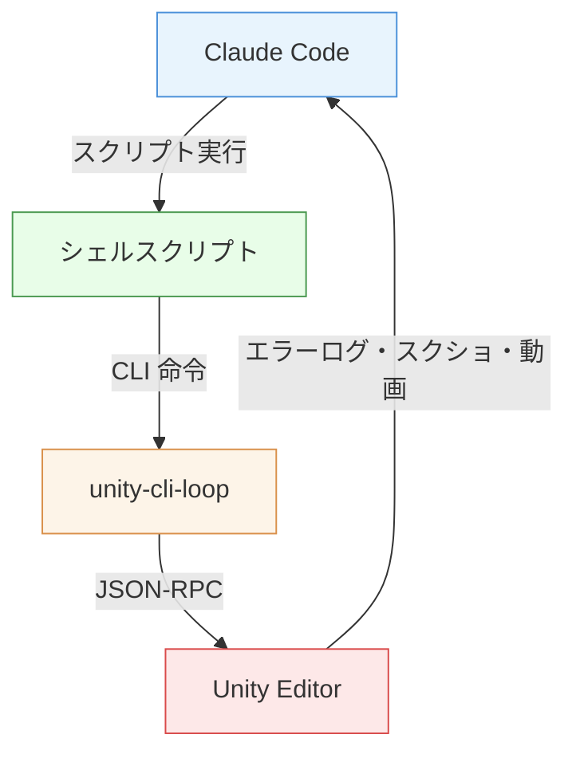
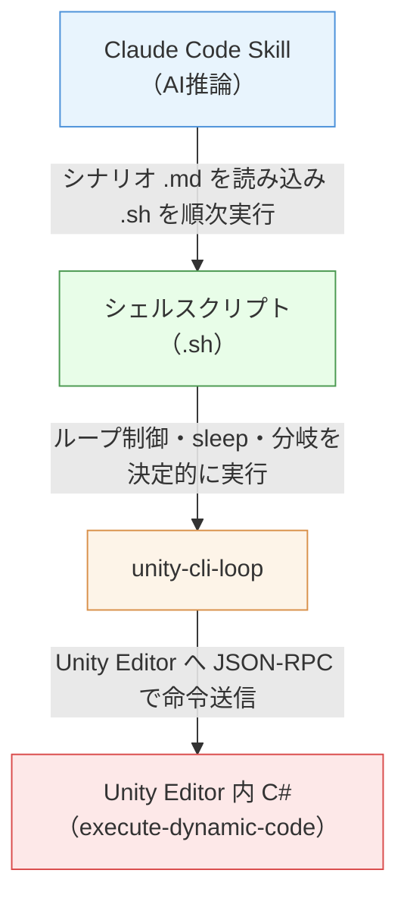
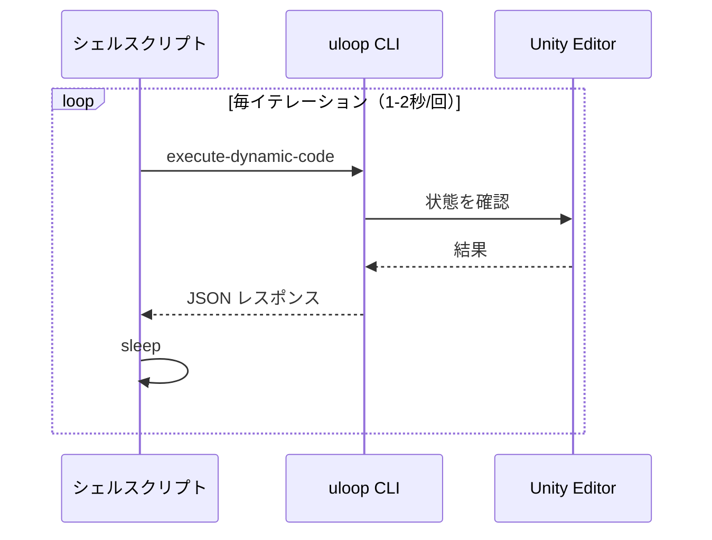
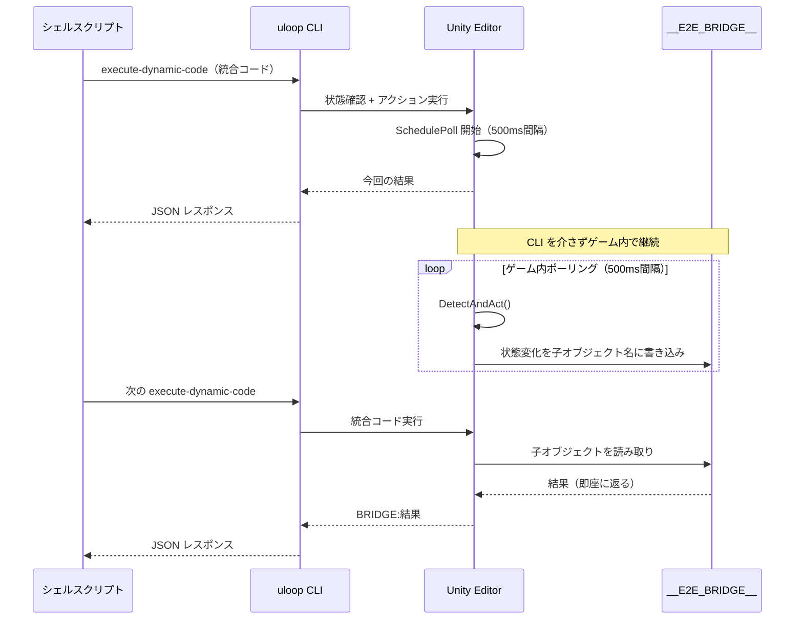

## チュートリアル確認、毎回手動で回すのしんどい問題

ゲーム開発をしていると、チュートリアルの回帰テストは避けて通れない作業です。

セーブデータを初期化して、起動して、規約に同意して、ミニゲームをクリアして、メインゲームのチュートリアルをひと通りこなして、ボスを倒して……

1回通すだけで数分かかるこのフローを、コードを変更するたびに手動で確認するのはなかなかしんどいです。

そこで試しに、**Claude Code** と **[Unity CLI Loop](https://github.com/hatayama/unity-cli-loop)** を組み合わせて、初回起動チュートリアルの完走を丸ごと自動化する E2E テスト基盤を構築してみました。



まだ最適解を見つけたとは言えませんが、ひとつのアプローチとして「こんなやり方もあるよ」という紹介ができればと思います。

なお、Unity CLI Loop（旧：uLoopMCP）については過去記事で紹介しているので、基本的な仕組みはそちらを参照してください。

https://zenn.dev/unsoluble_sugar/articles/cd8d59be7b8f85

:::message
以下 **unity-cli-loop** と記載します。
:::

本記事では、以下の内容を紹介します。

- E2Eテスト基盤の全体アーキテクチャと設計方針
- 初回起動チュートリアルの自動化シナリオ
- CLI 呼び出しのオーバーヘッドを57%削減した「状態ブリッジ方式」
- スクリーンショット・動画録画によるアウトプット

## 全体アーキテクチャ

今回構築したE2Eテスト基盤は、以下の4層構造になっています。



| 層 | 担当 | 特徴 |
|---|---|---|
| Claude Code Skill | シナリオ読み込み、スクリプト実行順制御、結果判定・レポート | 最小限の判断のみ。テストロジックには関与しない |
| シェルスクリプト | テストフロー制御、ループ、sleep、リトライ | 決定的に動作。再現性が高い |
| unity-cli-loop | Unity Editor への命令送信 | `execute-dynamic-code` で C# を動的実行 |
| Unity 内 C# | ボタンクリック、状態検知、ブリッジ書き込み | ゲーム内オブジェクトを直接操作 |

:::message
Claude Code の Skill は、特定のタスクを実行するためのプロンプト定義です。シナリオの `.md` ファイルを読み込んで手順通りにスクリプトを実行する、という振る舞いを Skill として定義しています。
:::

## テスト対象：初回起動チュートリアル

### ゲーム概要

今回のテスト対象は、業務で開発しているモバイル向けのカジュアルRPGです。メインゲームではランダムイベント（バトルやアイテム獲得など）を消化しながらステージを進めていく仕組みで、初回起動時にはこのゲームシステムをひと通り体験するチュートリアルが用意されています。

### チュートリアルの流れ

```
Boot（起動） → 利用規約同意 → Opening演出 → ミニゲーム
→ メインゲーム（複数ステップ） → ボス撃破 → 次ステージへ
```

チュートリアル中には、コイン獲得、バトル、装備獲得、仲間救出、強化、装備交換など、ゲームの主要機能がほぼ全て登場します。途中でポップアップダイアログが表示されたり、報酬の受け取りが挟まったりと、状態遷移がかなり複雑です。

### なぜチュートリアルをE2Eテストにしたか

E2Eテストの対象としては他の機能も候補にありましたが、そもそも「AI を使った自動化でどこまでできるのか」の塩梅をつかみたいという目的がありました。

その点で、初回起動チュートリアルは最初の題材として適切だと判断しました。

- ゲームの主要機能をひと通り網羅するフローなので、自動で通せれば広範囲の回帰テストになる
- セーブデータを初期化すれば毎回同じ状態から開始できるため、再現性の確保が容易
- フローが固定されているので、自動化の難易度を見極めやすい

## 設計方針：AIに何をやらせて、何をやらせないか

### 最初のアプローチ：AI がすべて判断する方式

当初は「Claude が毎ステップ判断してインタラクティブに操作する」方式で実装していました。

イテレーションごとに画面上のテキストやUI要素を `execute-dynamic-code` で取得し、その結果を見て AI が「次はこのボタンをクリック」「ここは自動進行なので待つ」と判断する設計です。

これはこれで動きました。AI がゲーム画面の状況をテキスト情報として受け取り、テーブルに照らして次のアクションを決定する。柔軟性は高く、新しいダイアログが出ても AI が臨機応変に対処できます。

ただし、次のような問題がありました。

- **トークン消費が激しい**: 毎イテレーションで状態取得結果を AI に渡して判断を仰ぐため、チュートリアル1回の完走でかなりのトークンを消費する
- **実行時間が長い**: AI の推論待ち + CLI 呼び出しのオーバーヘッドで、最も複雑なメインループ部分だけで約240秒かかる
- **再現性が低い**: AI の判断が毎回微妙に異なるため、同じシナリオでも挙動がブレることがある

### 方針転換：テストロジックをシェルスクリプトに固める

そこで方針を転換し、**テストロジックをすべてシェルスクリプトに固める**ことにしました。

- **シェルスクリプト**: 何をどの順で実行し、どう分岐するかはすべてスクリプト内で完結。ループ回数・sleep 時間・リトライ上限も固定値
- **AI推論（Claude Code Skill）**: シナリオファイル（`.md`）を読んでスクリプトを順次 bash 実行し、最終結果をレポートにまとめるだけ

AI の「柔軟な判断力」は便利ですが、チュートリアルのE2Eテストにおいてはフローが固定されているので、判断が必要な場面はほとんどありません。

ダイアログのパターンとボタンの対応を C# のコードに書き下してしまえば、AI に聞くまでもなく決定的に処理できます。

この転換によって、先述の3つの課題がいずれも改善しました。

- **トークン消費**: AI は各ステップのシェルスクリプトを順次 bash 実行 + スクリーンショット確認 + レポート生成しかしないため、**入力 約17,000〜20,000 / 出力 約1,500** 程度に収まるようになりました
- **実行時間**: AI の推論待ちがなくなった分、最も複雑なメインループ部分が 240秒 → 104秒に短縮。さらに後述する「状態ブリッジ方式」の導入でゲーム内ポーリングも高速化しています
- **再現性**: 分岐ロジックがすべてスクリプトに固定されているため、同じシナリオは毎回同じ手順で実行されます。AI の判断ブレに悩まされることがなくなりました

数分間のゲームプレイを丸ごと自動化しても、かかるトークンは Claude Code で簡単な質問をする2〜3回分程度です。もし AI 判断方式のままだったら、80回以上のイテレーションで毎回コンテキストが蓄積されていくため、桁違いの消費量になっていたでしょう。

### UI操作のアプローチ比較：決め打ち vs AI自律判断

今回のE2Eテストでは `GameObject.Find("ボタン名")` + `onClick.Invoke()` でボタンを名前指定してクリックする方式を採用しています。一方で、AIエージェントに Unity UI を自動認識・操作させるアプローチも存在します。

https://technote.qualiarts.jp/article/105

| 観点 | 決め打ち方式（今回） | AI 自律判断方式 |
|---|---|---|
| UI 要素の特定 | `GameObject.Find` で名前指定 | Selectable 全収集 + Raycast で汎用的に検出 |
| 操作判断 | スクリプトに固定ロジック | AI が毎回メタデータを見て判断 |
| 柔軟性 | ボタン名変更時はスクリプト修正が必要 | UI 変更に AI が適応できる可能性あり |
| 再現性 | 決定的。毎回同じ | AI の判断でブレあり |
| トークン消費 | AI はスクリプト実行のみ。低コスト | 毎ステップで UI メタデータ → AI 判断。高コスト |
| 速度 | シェルスクリプトで高速実行 | 毎回 AI 推論 + UI 全収集のオーバーヘッド |

チュートリアルのようにフローが固定されているテストでは、**どのダイアログが出てどのボタンを押すかが事前に分かっている**ため、AI に毎回判断させるメリットは薄いと考えています。再現性・速度・コストの面で**決め打ち方式が適切**と判断しました。

逆に AI 自律判断方式が活きるのは、フローが確定する前の探索的テストや、UI の変更が頻繁でパターンの事前定義が追いつかないケースでしょう。

## シナリオとスクリプト群

### ファイル構成

```
.claude/skills/e2e-test/
├── SKILL.md                        # Skill定義（前提条件・共通手順）
├── scenarios/
│   ├── boot-to-main.md             # 基本シナリオ（Boot→Main遷移確認）
│   └── first-launch-tutorial.md    # チュートリアル完走シナリオ
└── scripts/
    ├── lib/
    │   └── uloop-helpers.sh        # 共通関数ライブラリ
    ├── e2e-save-reset.sh           # Step 0: セーブデータ退避+リセット
    ├── e2e-boot-playmode.sh        # Step 1: Boot→PlayMode開始
    ├── e2e-terms-and-record.sh     # Step 2: 利用規約同意+録画開始
    ├── e2e-opening-skip.sh         # Step 3: Opening スキップ
    ├── e2e-minigame.sh              # Step 4: ミニゲームチュートリアル
    ├── e2e-main-loop.sh            # Step 5: メインゲームループ自動化
    └── e2e-cleanup.sh              # Step 7-8: エラー確認+クリーンアップ
```

シナリオファイル（`.md`）が「何をテストするか」を定義し、シェルスクリプト（`.sh`）が「どう実行するか」を担います。Claude Code は `.md` を読み込んで `.sh` を順次実行するだけです。

### 実行フロー

| Step | スクリプト | やること |
|------|-----------|---------|
| 0 | `e2e-save-reset.sh` | セーブDB退避 → DB削除 → PlayerPrefs削除 |
| 1 | `e2e-boot-playmode.sh` | Boot シーンを開く → PlayMode 開始 |
| 2 | `e2e-terms-and-record.sh` | 利用規約ボタンクリック → MP4 録画開始 |
| 3 | `e2e-opening-skip.sh` | Opening 演出をスキップ |
| 4 | `e2e-minigame.sh` | ミニゲームチュートリアルを実行 |
| 5 | `e2e-main-loop.sh` | メインゲームのチュートリアルステップを自動消化 |
| 6 | — | スクリーンショットでチュートリアル完了を目視確認 |
| 7-8 | `e2e-cleanup.sh` | エラーログ確認 → 録画停止 → PlayMode 終了 → セーブ復元 |

### 各スクリプトの要点

#### Step 0: セーブデータのリセット

毎回「初回起動」状態を作るために、シェルコマンドでDBとPlayerPrefsを直接削除しています。

```bash
# 現在のセーブデータをバックアップに退避
if [ -f "$DB_DIR/MyGame.db" ]; then
  cp "$DB_DIR/MyGame.db" "$DB_DIR/MyGame_backup.db"
fi
# DB削除 + PlayerPrefs削除
rm -f "$DB_DIR/MyGame.db"
defaults delete "unity.MyCompany.MyGame" 2>/dev/null
```

テスト完了後（Step 8）にバックアップから復元するので、開発中のセーブデータが消える心配はありません。

#### Step 1: PlayMode 開始

unity-cli-loop 経由で Boot シーンを開き、PlayMode を開始します。

```bash
uloop_exec 'UnityEditor.SceneManagement.EditorSceneManager.OpenScene("Assets/.../Boot.unity");'
uloop clear-console
uloop control-play-mode --action Play
sleep 1
close_remote_config  # 開発用ダイアログを閉じる
```

`close_remote_config` は開発ビルド特有のダイアログを閉じるヘルパー関数です。同名の `CloseButton` を持つ別のUIと衝突しないよう、Canvas 名で特定してからクリックする実装になっています。なお、対象のオブジェクトに固有の Tag を振っておけば `GameObject.FindWithTag` で一意に特定できるので、そちらのほうがシンプルに解決できるケースもあります。

#### Step 2-3: 利用規約同意と Opening スキップ

ここでは `poll_and_click` というヘルパー関数が活躍します。固定の `sleep` ではなく、ボタンが出現するまでポーリングしてからクリックする方式です。

```bash
poll_and_click "StartButton" 1 10   # 1秒間隔、最大10回ポーリング
start_recording "first_launch_tutorial"  # MP4録画開始
```

```bash
poll_and_click "SkipButton" 0.5 20  # 0.5秒間隔、最大20回
```

固定 sleep だと「画面遷移が早ければ無駄に待つ、遅ければタイムアウト」になりがちですが、ポーリング方式なら遷移完了を検知して即座に次のアクションに移れます。

#### Step 4: ミニゲーム

チュートリアルの序盤にあるミニゲームは、少し凝った制御が必要でした。物理演算を使ったインタラクションがあり、PointerDown/Up イベントを正確なタイミングで発火させる必要があります。

```csharp
// PointerDown でインタラクション開始
ExecuteEvents.Execute(trigger, eventData, ExecuteEvents.pointerDownHandler);

// UniTask.Void でゲーム時間ベースの遅延後に自動停止
UniTask.Void(async () => {
    await UniTask.WaitUntil(() => Time.timeScale > 0.5f);
    var startGameTime = Time.time;
    await UniTask.WaitUntil(() => Time.time - startGameTime >= targetDuration);
    rigidbody.angularVelocity = Vector3.zero;
    ExecuteEvents.Execute(trigger, upData, ExecuteEvents.pointerUpHandler);
});
```

ポイントは **`UniTask.Void` でゲーム内時間ベースの遅延処理をスケジュールしている** ことです。bash 側から `sleep` で待つと実時間と TimeScale のズレで不正確になりますが、ゲーム内の `Time.time` を基準にすれば狙った結果を安定して再現できます。

#### Step 5: メインゲームループ（次セクションで詳述）

チュートリアルの各ステップを自動消化する、このE2Eテストの最も複雑なパートです。「状態ブリッジ方式」という独自の最適化手法を導入しています。

#### Step 7-8: クリーンアップ

テスト終了時は、エラーログの確認 → 録画停止 → PlayMode 終了 → セーブ復元を順に行います。

```bash
# エラーログ確認
errorCount=$(uloop get-logs --log-type Error 2>/dev/null \
  | python3 -c "import sys,json; print(json.load(sys.stdin).get('TotalCount',0))")
# スクリーンショット取得
screenshotPath=$(uloop screenshot --window-name Game --capture-mode rendering \
  --output-directory /tmp 2>/dev/null \
  | python3 -c "import sys,json; print(json.load(sys.stdin).get('Screenshots',[{}])[0].get('ImagePath',''))")
# 録画停止（PlayMode 停止前に！）
stop_recording
# PlayMode 終了
uloop control-play-mode --action Stop
# セーブ復元
cp "$DB_DIR/MyGame_backup.db" "$DB_DIR/MyGame.db"
```

:::message
録画停止は **必ず PlayMode 停止の前** に実行する必要があります。順序を間違えると MP4 ファイルが正しくファイナライズされません。クリーンアップスクリプトでは `set -e` を外し、録画停止が失敗してもセーブ復元まで確実に完了するようにしています。
:::

## 状態ブリッジ方式：CLIオーバーヘッドの削減

メインゲームのチュートリアル自動化で最大の課題になったのが、**CLI 呼び出しのオーバーヘッド**でした。

### 課題

unity-cli-loop を1回呼び出すのに約1〜2秒かかります。チュートリアルの各ステップで発生するイベント（ダイアログ表示、ボタンクリック、メインのインタラクション操作、自動演出の待機…）を1つずつ確認していたら、それだけで数分かかってしまいます。

```
通常方式:
シェル → uloop(1-2秒) → 結果 → sleep → uloop(1-2秒) → 結果 → sleep → ...
```

### 解決策：ゲーム内ポーリング + Bridge GameObject

そこで導入したのが「状態ブリッジ方式」です。CLI（外部プロセス）とゲーム内（Unity ランタイム）という2つの異なる世界を橋渡しする仕組みなので、そう呼んでいます。

核となるアイデアは、**`DontDestroyOnLoad` な Bridge GameObject をバッファとして使い、ゲーム内で非同期にポーリングした結果を子オブジェクトの名前として書き込む**というものです。

なぜ static 変数や PlayerPrefs ではなく子オブジェクトの名前かというと、`execute-dynamic-code` は実行のたびに独立したコンテキストで評価されるため、static 変数を跨いで共有できません。

一方 `GameObject.Find` はシーン上のオブジェクトを横断的に検索できるので、永続化した GameObject の子構造であれば CLI の呼び出しをまたいで確実に読み書きできます。

通常方式では、状態確認のたびに CLI を呼び出す必要があります。



ブリッジ方式では、ゲーム内で非同期ポーリングが走り、次の CLI 呼び出し時には結果が即座に取れます。



### 実装

まず Bridge の初期化と結果の読み取りです。

```csharp
// Bridge がなければ作成（DontDestroyOnLoad で永続化）
var bridge = GameObject.Find("__E2E_BRIDGE__");
if (bridge == null) {
    bridge = new GameObject("__E2E_BRIDGE__");
    Object.DontDestroyOnLoad(bridge);
}

// 前回のポーリング結果があれば読み取って返す
if (bridge.transform.childCount > 0) {
    var child = bridge.transform.GetChild(0);
    var result = child.name;      // 子オブジェクト名 = 状態
    Object.Destroy(child.gameObject);
    return $"BRIDGE:{result}";
}
```

状態検知とアクション実行は `DetectAndAct()` 関数に集約しています。

```csharp
string DetectAndAct() {
    // Editor一時停止チェック（エラー検知）
    if (EditorApplication.isPaused) return "STATE:paused";

    // チュートリアル完了判定
    var autoSpin = GameObject.Find("AutoSpinButton");
    if (autoSpin != null && autoSpin.activeInHierarchy) {
        var c = autoSpin.GetComponentInParent<Canvas>();
        if (c != null && c.sortingOrder >= 11000) return "COMPLETE";
    }

    // ダイアログ検知 + ボタンクリック
    string[][] dialogs = {
        new[]{"GotQuestReward(Clone)", "CloseButton", "closed_reward"},
        new[]{"GotReward(Clone)", "CloseButton", "got_reward_closed"},
        new[]{"GetGearDialog(Clone)", "EquipButton", "equip_gear"},
        // ... 他のダイアログ
    };
    foreach (var db in dialogs) {
        var dialog = GameObject.Find(db[0]);
        if (dialog != null && dialog.activeInHierarchy) {
            foreach (var b in dialog.GetComponentsInChildren<Button>(true)) {
                if (b.gameObject.name == db[1] && b.interactable) {
                    b.onClick.Invoke();
                    return $"ACTION:{db[2]}";
                }
            }
        }
    }
    // ... メインボタンの検知も同様
    return "NO_ACTION";
}
```

そして、ゲーム内ポーリングのスケジュールです。

```csharp
void SchedulePoll(GameObject br) {
    UniTask.Void(async () => {
        for (int i = 0; i < 20; i++) {
            await UniTask.Delay(500);           // 500ms × 20回 = 最大10秒
            if (br == null) return;
            var state = DetectAndAct();          // 状態検知（共通関数）
            if (state != "NO_ACTION") {
                var child = new GameObject(state);   // 結果を子オブジェクト名に書き込み
                child.transform.SetParent(br.transform);
                return;
            }
        }
        // タイムアウト
        if (br != null) {
            var child = new GameObject("TIMEOUT");
            child.transform.SetParent(br.transform);
        }
    });
}
```

bash 側のループは、返り値に応じてシンプルに分岐するだけです。

```bash
while [ $iteration -lt $maxIterations ]; do
  iteration=$((iteration + 1))
  result=$(uloop_exec "$UNIFIED_CODE")

  case "$result" in
    COMPLETE|BRIDGE:COMPLETE)
      echo "=== TUTORIAL COMPLETE ===" ; break ;;
    STATE:paused|BRIDGE:STATE:paused)
      echo "=== Error detected ===" ; exit 1 ;;
    BRIDGE:*)
      stallCount=0 ;;           # ゲーム内ポーリング結果 → 即次へ
    MAIN_INTERACTION)
      stallCount=0 ; sleep 2 ;; # メインのインタラクション操作済み
    ACTION:*|MAIN_BTN:*)
      stallCount=0 ; sleep 2 ;; # ダイアログ/ボタンクリック済み
    NO_ACTION)
      stallCount=$((stallCount + 1))
      if [ $stallCount -ge 15 ]; then
        uloop screenshot ...    # 停滞検知 → スクショ1回だけ
      fi ;;
  esac
done
```

### 効果

この最適化によって、チュートリアルループの実行時間が **240秒 → 104秒（57%削減）** に短縮されました。

| 方式 | 仕組み | 所要時間 |
|------|--------|---------|
| 通常方式 | 毎回 CLI で状態確認 | 約240秒 |
| ブリッジ方式 | ゲーム内ポーリング + 結果バッファ | 約104秒 |

ブリッジ方式では、CLI 呼び出し1回で「前回の結果読み取り + 今回のアクション実行 + 次回のポーリングスケジュール」をまとめて行えるため、CLI のラウンドトリップ回数が大幅に減っています。

なお、104秒という数字は人間が手動でチュートリアルを操作した場合とほぼ同等の速度です。CLI のオーバーヘッドを差し引けば、ゲーム内の処理自体は人間の操作テンポと変わらないペースで進んでいることになります。

## 共通ライブラリ：uloop-helpers.sh

テスト全体を支える共通関数を `uloop-helpers.sh` にまとめています。

| 関数 | 用途 |
|------|------|
| `uloop_exec` | C# コードを `execute-dynamic-code` で実行し、JSON から結果を抽出 |
| `close_remote_config` | 開発用ダイアログを Canvas 名で特定して閉じる |
| `poll_and_click` | ボタン出現をポーリング → クリック |
| `read_bridge` | Bridge の子オブジェクトから結果を読み取り |
| `destroy_bridge` | Bridge GameObject を破棄 |
| `start_recording` | Unity Recorder で MP4 録画開始 |
| `stop_recording` | 録画停止 + ファイルパス出力 |

### uloop_exec：C# 実行の基本関数

すべてのスクリプトで使われる最も基本的な関数です。

```bash
uloop_exec() {
  local response
  response=$(uloop execute-dynamic-code --code "$1" 2>/dev/null) || { echo ""; return; }
  echo "$response" | python3 -c \
    "import sys,json; print(json.load(sys.stdin).get('Result',''))" 2>/dev/null || echo ""
}
```

unity-cli-loop が返す JSON から `Result` フィールドを抽出するだけのシンプルな関数ですが、接続エラー時に空文字を返す設計にしているのがポイントです。

これにより、bash 側の条件分岐が `if [ "$result" = "clicked" ]` のようにシンプルに書けます。

### poll_and_click：ポーリングクリック

UI要素が非同期に出現するゲームでは、「ボタンが見つかるまで待つ → 見つかったらクリック」というパターンが頻出します。

```bash
poll_and_click() {
  local button_name="$1"
  local interval="${2:-1}"       # ポーリング間隔（デフォルト1秒）
  local max_attempts="${3:-10}"  # 最大試行回数（デフォルト10回）
  for i in $(seq 1 "$max_attempts"); do
    local result
    result=$(uloop_exec "
      var go = UnityEngine.GameObject.Find(\"$button_name\");
      if (go == null) return \"not_found\";
      go.GetComponent<UnityEngine.UI.Button>().onClick.Invoke();
      return \"clicked\";
    ")
    if [ "$result" = "clicked" ]; then return 0; fi
    sleep "$interval"
  done
  return 1
}
```

ボタンの `onClick.Invoke()` を直接呼ぶことで、マウスシミュレーションによる座標計算の複雑さを回避しています。

ただし、クリック後にダイアログが即座に破棄されるケースでは `simulate-mouse-ui` だとエラーになることがあり、`onClick.Invoke()` のほうが安全というのは開発を通じて学んだことでした。

## アウトプット

E2Eテストの結果は、3つの形式で残します。

### スクリーンショット

テスト完了時に Game View のスクリーンショットを取得します。

```bash
uloop screenshot --window-name Game --capture-mode rendering --output-directory /tmp
```

実は当初、各ステップごとにスクリーンショットを撮影して状況把握に使っていました。しかし、これだと1回のテストで大量のスクリーンショットが生成されてしまい、確認が大変なうえにオーバーヘッドにもなっていました。

最終的に、テスト全体の流れは後述する**動画録画**で記録する方針に切り替えたことで、スクリーンショットの役割は「停滞検知時やエラー時のピンポイントな証跡」に絞ることができました。

メインループ中に15イテレーション以上アクションがない場合や、同じアクションが繰り返された場合に1枚だけ撮影する、という運用に落ち着いています。

### 動画録画

テスト全体の流れを MP4 動画で記録します。Unity Recorder を使って、利用規約同意のタイミングから録画を開始し、クリーンアップ時に停止します。

| 項目 | 設定 |
|------|------|
| フォーマット | MP4 (H.264) |
| FPS | 30 |
| 解像度 | 540 × 960（Game View の半分） |
| 品質 | Medium |
| 音声 | あり |
| ファイルサイズ | 約24MB |

当初はフル解像度で録画していたため100MB近くになっていましたが、E2Eテストの証跡としては半解像度で十分と判断し、24MBまで削減しました。

動画で記録しておけば、テスト実行中に画面に張り付いて見張る必要がありません。手動確認でありがちな「一瞬表示されたダイアログを見落とす」「似た画面を見間違える」といったヒューマンエラーも起きません。テスト失敗時には「どこまで進んでどこで止まったか」を動画で巻き戻して確認できるので、原因調査も効率的です。

https://docs.unity3d.com/Packages/com.unity.recorder@5.0/manual/index.html

### 結果レポート

各スクリプトの実行が終わると、Claude Code がテスト全体の結果をテーブル形式のレポートにまとめます。各ステップの成否、メインループのイテレーション回数と所要時間、エラーログの件数、スクリーンショットや録画ファイルのパスが一覧で確認できるので、テストが通ったかどうかをひと目で把握できます。

```markdown
## E2E テスト結果: 初回起動チュートリアル完走

| チェック項目 | 結果 | 詳細 |
|---|---|---|
| Boot シーン起動 | ✅ OK | Boot.unity から起動 |
| セーブデータ退避 | ✅ OK | バックアップ済み |
| Opening スキップ | ✅ OK | SkipButton クリック |
| ミニゲーム完了 | ✅ OK | インタラクション実行 → シーンアンロード確認 |
| メインチュートリアル | ✅ OK | 65 iterations / 117秒で完了 |
| チュートリアル完了 | ✅ OK | 完了演出の表示を確認 |
| エラーログ | ✅ OK | 0 件 |
| セーブデータ復元 | ✅ OK | バックアップから復元 |
| スクリーンショット | 取得済み | （パス） |
| 動画録画 | 取得済み | first_launch_tutorial_20260403_110821.mp4 |
```

エラーが発生していた場合は `uloop get-logs --log-type Error` で取得したエラーメッセージもレポートに含まれるため、何が原因で失敗したのかをレポート上で追えます。スクリーンショットや動画と合わせて確認すれば、テスト実行後に Unity Editor を開き直さなくても状況が把握できるのが利点です。

今回はあくまで開発環境のローカル動作を前提としていますが、もう少し作り込むなら、このレポートを Slack に通知したり、CI/CD パイプラインを構築して専用マシン上でテスト実行を自動化したりといった拡張も考えられます。レポートがテキストベースのテーブル形式なので、通知や集計との連携はしやすい構造になっています。

## 設計上の補足

### 作り込みすぎない

今回はテストフレームワークを自作するような大掛かりなことはしていません。bash + unity-cli-loop + C# の動的実行で十分です。実際、`.sh` ファイルは1つあたり15〜30行程度。共通関数も7つだけ。テストシナリオは Markdown で書かれていて、人間が読んでも流れが分かります。

「将来的に汎用テストランナーに育てよう」みたいな野心は捨てて、**今必要なテストを今動かす**ことを優先しました。

作り込みを避けるもうひとつの理由は、**周辺ツールの進化が速い**ことです。unity-cli-loop 自体も活発にアップデートされていますし、Unity公式のMCP対応やEditorの機能強化も進んでいます。

https://docs.unity3d.com/Packages/com.unity.ai.assistant@2.0/manual/unity-mcp-overview.html

将来的には、ゲーム向けE2Eテストを専門に扱う外部ツールが登場して丸ごと載せ替える、という展開も十分ありえます。そうなったときに、作り込んだ自前のフレームワークが足枷にならないよう、必要最小限に留めておくのが得策だと考えています。

### エラーハンドリング

E2Eテストでエラーを無視するのは禁物です。「とりあえずスキップして先に進む」をやると、テストが通っても意味がなくなります。

**検知と停止**

`poll_and_click` の上限回数超過やブリッジ方式の `maxIterations` 到達でエラー終了させるほか、`EditorApplication.isPaused` でエラーポーズを検知したら即停止します。メインループでは停滞検知（15イテレーション以上変化なし）も設けており、無限に回り続けることはありません。

**証跡の自動収集**

エラー発生時にスクリーンショット撮影やエラーログ取得まで自律的に行えるのは、unity-cli-loop を採用したからこその強みです。`uloop screenshot` でその瞬間の Game View を保存し、`uloop get-logs --log-type Error` でエラーメッセージを取得する。これらが CLI のコマンドとしてすでに用意されているため、シェルスクリプトから数行で呼び出すだけで証跡が揃います。自前でスクリーンショット機能やログ収集の仕組みを実装する必要がなかったのは大きかったです。

**クリーンアップの確実な完了**

Step 7-8 のクリーンアップでは `set -e` を外しています。録画停止や PlayMode 停止が失敗しても、セーブデータの復元まで確実に完了することを優先するためです。テストが失敗しても開発環境が壊れた状態で放置されない、というのは安心して繰り返し実行するための前提条件です。

## まとめ

初回起動チュートリアルのE2Eテストは、最も複雑なメインループ部分が当初の AI 判断方式では約240秒かかっていましたが、テストロジックをシェルスクリプトに固め、状態ブリッジ方式を導入することで **約104秒まで短縮（57%削減）** できました。CLI 呼び出しのオーバーヘッドを大幅に削減し、エラー0件でチュートリアル完走を達成しています。

Claude Code にやらせているのは「各ステップのスクリプトを順次実行してレポートを書く」だけ。テストロジックはすべてシェルスクリプトと C# に固められており、AI の推論に依存しない再現性の高い自動テストになっています。

今後はシナリオの追加（ショップ購入フロー、ガチャ演出など）や、CI パイプラインへの統合も視野に入れています。unity-cli-loop が Unity Editor を外部から操作できるおかげで、bash スクリプトを書き足すだけでテストを拡張できるのは大きな強みです。

「AI にテストを任せる」というと、AI が画面を見て判断するようなイメージを持つかもしれませんが、実際にはロジックを決定的なコードに落とし込んで AI の介在を最小化するほうが、速く・安く・確実に動きます。

AI の役割はスクリプトの実行指示と結果のレポーティングに絞り、テストロジックそのものはスクリプトに任せる。少なくとも、フローが固定された初回起動チュートリアルのようなユースケースでは、この設計方針が合っていたと感じています。

## 参考

https://github.com/hatayama/unity-cli-loop
https://docs.anthropic.com/en/docs/claude-code
https://zenn.dev/unsoluble_sugar/articles/cd8d59be7b8f85
https://technote.qualiarts.jp/article/105
