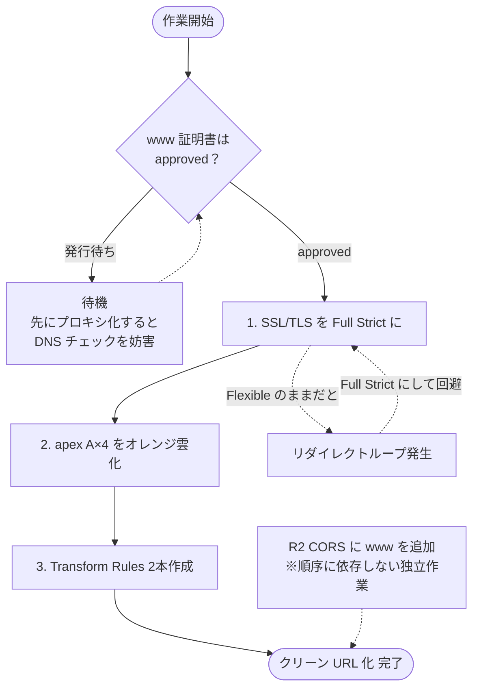

## はじめに

:::details 追記：続編を公開しました
本記事のクリーンURL化完了後、アクセス解析（Cloudflare Web Analytics）の導入と公開直前の CSP 不備の修正を経て、β版公開に至るまでの記録です。あわせてどうぞ。

https://zenn.dev/unsoluble_sugar/articles/867452eabeaa20
:::

先日、個人開発中のWebアプリ向けに「独自ドメイン取得〜公開基盤の構築」を行った記録を記事にしました。

https://zenn.dev/unsoluble_sugar/articles/a6fb2c3efd5a66

前回記事の末尾で「まだ作業途中」としていた **クリーンURL化（Cloudflare プロキシ + Transform Rules）** を完了させたので、その際の手順・設定値・ハマりどころをまとめます。あわせて実施した R2 の CORS 設定追加についても触れます。

:::message
未リリースのプロダクトのため、前回記事と同様にドメインを `myapp.app`、アセット配信用サブドメインを `assets.myapp.app` という仮名で表記します。
:::

今回も作業には Claude Code を活用しています。特に「どの順序で設定を変えるとリダイレクトループや証明書発行の妨害が起きるか」という依存関係の整理を対話で固めてから作業に入れたのが大きく、本番ドメインの設定変更にもかかわらずトラブルなしで完了できました。

### 今回やったこと

1. 前提条件の確認（www 証明書の発行完了待ち）
2. SSL/TLS を Full (Strict) に設定
3. apex の A レコードをプロキシ化（オレンジ雲）
4. Transform Rules（URL 書き換え）2本の作成
5. R2 CORS への www オリジン追加

この作業は **順序が命** で、各ステップを守らないとリダイレクトループや証明書発行の妨害が起きます。まず全体の依存関係と「なぜその順序なのか」を1枚の図にまとめておきます。



以降のセクションは、この図のステップ順に沿って進めます。

## 背景・課題

まず前提の整理です。本アプリの配信には、次の2つの制約があります。

- 本体 HTML は、使用しているランタイムの制約で `index.dc.html`・`app.dc.html` という **拡張子付きのファイル名** になっている
- 一方、GitHub Pages がルート `/` として自動配信するのは `index.html` のみ

そこでこれまでは、`/`・`/app` でアクセスできる入口として **リダイレクトスタブ** を置いていました。`index.html` → `index.dc.html` へ、`app/index.html` → `../app.dc.html` へ飛ばすだけの小さな HTML です。

```bash
（これまで）リダイレクトスタブ方式
https://myapp.app/ へアクセス
   → スタブの index.html が index.dc.html へリダイレクト
   → 表示は正常。ただしアドレスバーは
     https://myapp.app/index.dc.html に変わってしまう
```

機能としては問題ないのですが、リダイレクトであるがゆえに **アドレスバーの表示が最終的に `.dc.html` 付きの URL に落ち着いてしまう** という見た目の課題が残っていました。

これを解消したいのですが、GitHub Pages には `.htaccess` や `_redirects` に相当するリライトエンジンがありません。そこで **Cloudflare のプロキシ（オレンジ雲）+ Transform Rules（URL 書き換え）** を手前に挟み、`/`・`/app` のままアドレスバーを変えずに本体を配信する構成へ切り替えることにしました。

```bash
[ユーザー]
   │ https://myapp.app/ ・ /app （アドレスバーはこのまま）
   ▼
[Cloudflare プロキシ]（apex A×4 オレンジ雲・SSL Full (Strict)）
   │ Transform Rules でパスだけ書き換え:
   │   "/"       → /index.dc.html
   │   "/app(/)" → /app.dc.html
   ▼
[GitHub Pages]（オリジン。リポジトリ側の変更は一切なし）
```

:::details 用語メモ：プロキシ（オレンジ雲）と DNS only（グレー雲）
Cloudflare の DNS レコードには「プロキシ状態」のトグルがあり、オン（オレンジ色の雲アイコン）にするとトラフィックが Cloudflare のエッジサーバーを経由するようになります。CDN キャッシュや後述の Transform Rules など Cloudflare の機能が効くのはオンのときだけ。オフ（グレー雲・DNS only）は名前解決だけを行い、通信はオリジンサーバーと直接行われます。前回記事の DNS 設定では、GitHub Pages の検証と証明書発行のために全レコードをグレー雲で作成していました。
:::

:::details 用語メモ：Transform Rules
Cloudflare のエッジでリクエスト/レスポンスを書き換えられるルール機能。今回使う「URL 書き換えルール（Rewrite URL）」は、ユーザーには元の URL を見せたまま、オリジンへのリクエストパスだけを別のパスに差し替えられます。リダイレクトと違ってブラウザ側の遷移が発生しないため、アドレスバーは変わりません。無料プランでも利用できます（作成できるルール本数に上限あり）。

https://developers.cloudflare.com/rules/transform/url-rewrite/
:::

ポイントは以下の2点です。

- **リポジトリ側の変更はゼロ**。リダイレクトスタブは削除せず温存する（プロキシを外した際のフォールバックとして機能する）
- `www` の CNAME は **グレー雲のまま** にする（GitHub 側の www → apex 301 リダイレクトと証明書自動更新を活かす）

## 0. 前提条件の確認: www 証明書の発行完了

作業に入る前に、GitHub Pages の証明書処理が落ち着いていることを確認します。状況を整理すると次のとおりです。

- 前回記事のハマりどころに書いたとおり、www の CNAME を後出ししたせいで **www カバレッジ付き証明書の再発行待ち** が発生していた
- 証明書の発行時、GitHub は「A レコードが GitHub Pages の IP を直接返すこと」を DNS チェックで確認している
- この状態のまま apex をオレンジ雲化すると、A レコードが Cloudflare の IP を返すようになり、**進行中の証明書発行を妨害しかねない**

つまり「プロキシ化に www 証明書が必要」なのではなく、「**証明書発行の完了前にプロキシ化してはいけない**」という逆向きの依存関係です。

確認コマンドは以下のとおりです。

```bash
# SSL エラーなく開ければ OK（301 が返るのが正常。www → apex は GitHub 側リダイレクト）
curl -sI https://www.myapp.app/

# GitHub API で証明書の状態とカバー範囲を確認
gh api repos/<owner>/<repo>/pages \
  --jq '{cert_state: .https_certificate.state, cert_domains: .https_certificate.domains}'
# → {"cert_domains":["myapp.app","www.myapp.app"],"cert_state":"approved"}
```

前回作業の時点では `certificate_state: dns_changed` で発行待ちでしたが、今回確認したところ `approved` になっており、apex・www 両方をカバーする証明書が発行完了していました。

あわせて、作業前の DNS 状態も確認しておきます（apex がまだ GitHub の IP を直接返す＝グレー雲であること）。

```bash
nslookup myapp.app 1.1.1.1   # → 185.199.108〜111.153（GitHub Pages の IP）
curl -sI https://myapp.app/ | grep -i server   # → server: GitHub.com
```

## 1. SSL/TLS を Full (Strict) に設定

ここからが本作業です。**順序が重要** で、プロキシ有効化より **先に** SSL モードを設定します。

Cloudflare の SSL モードがデフォルトの Flexible のままオレンジ雲にすると、Cloudflare → オリジン間の通信が HTTP になります。これが GitHub Pages 側の HTTPS 強制（`https_enforced: true`）と衝突し、「GitHub が HTTPS へリダイレクト → Cloudflare が HTTP でオリジンアクセス → またリダイレクト…」という **リダイレクトループ** が発生します。

設定はダッシュボードから、対象ゾーン → **SSL/TLS → 概要** → 暗号化モードを **「フル（厳格）/ Full (Strict)」** に変更するだけです（日本語 UI には、箇所によって「フル (厳密)」と表示される表記ゆれがあります）。


Full (Strict) はオリジン証明書の正当性まで検証するモードですが、GitHub Pages は Let's Encrypt の正規証明書を持っているため問題ありません。

https://developers.cloudflare.com/ssl/origin-configuration/ssl-modes/full-strict/

## 2. apex の A レコード 4 本をオレンジ雲化

次に **DNS → レコード** で、apex `myapp.app` の A レコード 4 本（`185.199.108.153` 〜 `111.153`）をそれぞれ編集し、プロキシ状態を **「プロキシ済み」（オレンジ雲）** に変更します。

変更前は 4 本とも「DNS のみ」（グレー雲）の状態です。


変更後、4 本とも「プロキシ済み」（オレンジ雲）になりました。


このとき **`www` の CNAME（→ `<ユーザー名>.github.io`）はグレー雲のまま触りません**。www を GitHub に直接向けたままにしておくことで、GitHub 側の www → apex リダイレクトと、約90日ごとの証明書自動更新（DNS チェックを伴う）がこれまでどおり機能します。

反映確認です。Cloudflare は権威 DNS なので、TTL が Auto ならほぼ即時に切り替わります。

```bash
nslookup myapp.app 1.1.1.1
# → 104.21.x.x / 172.67.x.x（Cloudflare の IP に変わる）

curl -sI https://myapp.app/ | grep -iE "server|cf-ray"
# → server: cloudflare / cf-ray: xxxx-NRT（東京 PoP 経由）

# リダイレクトループがないこと
curl -s -o /dev/null -L -w "%{http_code} redirects:%{num_redirects}\n" https://myapp.app/
# → 200 redirects:0
```

`server` ヘッダーが `GitHub.com` から `cloudflare` に変わり、`cf-ray` ヘッダー（Cloudflare を経由した証跡。末尾は経由した PoP のコード）が付くようになれば、プロキシ化は成功です。

## 3. Transform Rules（URL 書き換え）2 本

いよいよ本丸の URL 書き換えです。ダッシュボードの **ルール → 概要 → ルールを作成** から「URL 書き換えルール」を選択します。


作成するルールは以下の2本。いずれも「カスタム フィルタ式」でパスを判定し、パスを静的（Static）に書き換え、**クエリーは「保持」** にします。

| ルール名 | フィルタ式 | パス書き換え（Static） |
| --- | --- | --- |
| `clean-url-root` | `http.request.uri.path eq "/"` | `index.dc.html` |
| `clean-url-app` | `(http.request.uri.path eq "/app") or (http.request.uri.path eq "/app/")` | `app.dc.html` |

ルール1（`clean-url-root`）の設定画面です。


ルール2（`clean-url-app`）は `/app` と `/app/`（末尾スラッシュあり）の両方を OR 条件で拾います。


デプロイ後のルール一覧です。2本がアクティブになっています。


### ハマりどころ①: パス入力欄には固定の `/` プレフィックスがある

書き換え先パスの入力欄は `Static ▼ | / | 入力欄` というレイアウトで、**先頭のスラッシュが UI 側に固定表示されています**（入力例のプレースホルダーも `content/images/thumbnails` とスラッシュなしになっています）。


ここに気付かず `/index.dc.html` と入力すると、最終的なパスが `//index.dc.html` になってしまいます。**値は先頭のスラッシュを付けず `index.dc.html` と入力** します（ルール2も同様に `app.dc.html` と入力）。

### ハマりどころ②: デプロイ直後は古い応答が返ることがある

ルールのデプロイ直後の検証で、`/app` へのアクセスに1回だけ 301 → `/app/` が観測されました。これはオリジンの GitHub Pages がディレクトリリダイレクトを返した形跡、つまり **ルールがまだ適用されていない応答** です。

数十秒後に再検証したところ 200 の直返しに収束しました。エッジへのルール伝播にはラグがあるため、直後の検証で古い応答が出ても慌てず、少し待ってから再確認するのが正解です。

## 4. 動作確認

パス書き換えの検証コマンド一式です。ステータスコードとリダイレクト回数をまとめて出すシェル関数を作って回しました。

```bash
check() { curl -s -o /dev/null -w "$1 -> %{http_code} (redirects:%{num_redirects})\n" -L "$1"; }
check https://myapp.app/                    # 200 redirects:0（アドレスバー維持）
check https://myapp.app/app                 # 200 redirects:0
check https://myapp.app/app/                # 200 redirects:0
check "https://myapp.app/app?theme=dark"    # 200 redirects:0（クエリ保持）
check https://myapp.app/index.dc.html       # 200（直打ちも従来どおり）
check https://myapp.app/app.dc.html         # 200
check https://www.myapp.app/                # 301 → apex（GitHub 側リダイレクト健在）
```

さらに「書き換え先が正しい本体を返しているか」まで、コンテンツの一致で確認。

```bash
diff <(curl -s https://myapp.app/) <(curl -s https://myapp.app/index.dc.html)
diff <(curl -s https://myapp.app/app) <(curl -s https://myapp.app/app.dc.html)
```

リダイレクト0回で 200 が直接返り、アドレスバーは `/`・`/app` のまま維持されます。

なお、作業時点では前回記事で書いた coming-soon ゲートが有効なため、実際に返ってくるのはダミーページです。**Transform Rules はパスしか見ないので、正式公開への切り替え後もこの設定はそのまま機能します**。

## 5. R2 CORS に www オリジンを追加

ついで作業として、R2 の CORS ポリシーに www オリジンを追加しました。


前回記事の時点では、R2 の許可オリジンは apex（`https://myapp.app`）のみでした。現状 www へのアクセスは apex へ 301 されるため実害はないのですが、コード側のアセット基底 URL 切り替えは www でも R2 を指す設計のため、将来のリスクとして潰しておきます。

ダッシュボード → **R2 → バケット → 設定 → CORS ポリシー** を編集し、`AllowedOrigins` に `https://www.myapp.app` を追加します。

```json
[
  {
    "AllowedOrigins": [
      "https://myapp.app",
      "https://www.myapp.app"
    ],
    "AllowedMethods": ["GET", "HEAD"],
    "AllowedHeaders": ["*"],
    "ExposeHeaders": ["Content-Length", "ETag"],
    "MaxAgeSeconds": 86400
  }
]
```

検証は前回記事と同じ方針で、「許可オリジンに返ること」と「**許可外オリジンに返らないこと**」の両方を確認します。

```bash
for o in https://myapp.app https://www.myapp.app https://example.com; do
  echo "== Origin: $o =="
  curl -sI -H "Origin: $o" https://assets.myapp.app/assets/model-a.bin \
    | grep -i access-control-allow-origin
done
# → apex / www は access-control-allow-origin が返る
#   example.com はヘッダーなし（＝ブラウザでブロックされる）
```

なお、ローカル開発（localhost）はアセット基底 URL が空文字＝git 同梱ファイル参照で R2 を使わない設計のため、localhost オリジンの追加は不要です。

## 運用メモ

- プロキシ化後は、GitHub の証明書自動更新（約90日ごと）が稀に失敗する事例があるようです。証明書エラーが出たら「一時的にグレー雲へ戻す → 再発行 → オレンジ雲に戻す」で復旧できます
- リダイレクトスタブ（`index.html`・`app/index.html`）は **削除しません**。プロキシを外した場合のフォールバックで、消すと素の GitHub Pages では `/`・`/app` が 404 になります
- 副産物として、プロキシ化により **Cloudflare のゾーン解析**（リクエスト数・帯域のサーバー側統計）が使えるようになりました。クライアント側にスクリプトを入れないアクセス解析の前提が整ったことになります

## 学び・ハマりどころまとめ

1. **設定の順序が命**。「SSL Full (Strict) → オレンジ雲化 → Transform Rules 作成」の順で進める。Flexible のままオレンジ雲にするとリダイレクトループになる
2. **GitHub 側の証明書発行が完了してからプロキシ化する**。発行進行中にオレンジ雲化すると DNS チェックを妨害しうる
3. **www の CNAME はグレー雲のまま残す**。GitHub 側のリダイレクトと証明書自動更新を活かせる
4. **パス入力欄の固定 `/` プレフィックスに注意**。書き換え先はスラッシュなしで入力する
5. **デプロイ直後の古い応答に慌てない**。エッジへのルール伝播にはラグがある
6. **リダイレクトスタブは温存する**。プロキシを外しても壊れないフォールバックになる
7. **Transform Rules はパスしか見ない**。公開ゲートの切り替えと直交するので、公開前でも本番相当の検証ができる
8. **CORS の許可オリジンは「コードが参照しうるオリジン」全部を洗い出す**。www 経由のアクセスは盲点になりやすい

## おわりに

前回記事の時点で残っていたクリーンURL化が完了し、公開基盤まわりのタスクはすべて消化できました。残るは公開モードの切り替えのみです。

リダイレクトスタブ方式からの切り替え作業は、依存関係（証明書発行 → SSL モード → プロキシ化 → ルール作成）の順序さえ間違えなければ、リポジトリ側の変更ゼロ・ダウンタイムゼロで完了します。GitHub Pages のリライトエンジン不在に悩んでいる方の参考になれば幸いです。

プロダクト本体は引き続き開発中です。リリースの際にはまた記事にしようと思います。

https://zenn.dev/unsoluble_sugar/articles/a6fb2c3efd5a66