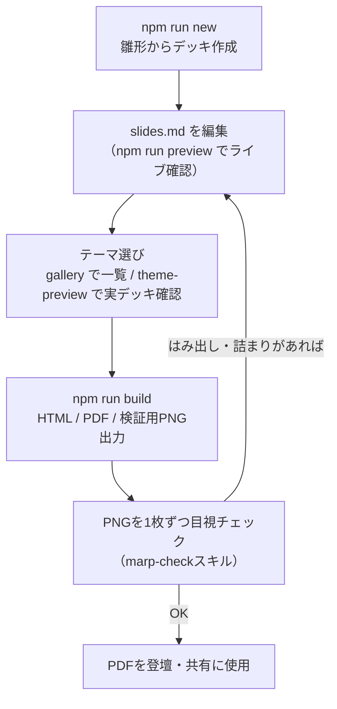

## はじめに

LT登壇や社内共有会のたびに、スライド資料づくりで消耗していました。話したい内容自体はザッと書けるのに、見た目を整える段階になるとスライド作成ツールと格闘する時間が発生します。

また、過去に書いた記事をスライド化して活かしたいときも、その「変換コスト」の高さで手が止まってしまう。そんな課題を解消するため、Marpベースのスライド制作環境を開発し、OSSとして公開しました。

https://github.com/unsolublesugar/marp-slides-studio

:::details 用語メモ：Marp
Markdownからプレゼンテーションスライドを生成できるOSSエコシステム。`---` 区切りでスライドを書き、CSSテーマで見た目を定義します。本プロジェクトはそのCLI実装である `@marp-team/marp-cli` を使っています。

https://marp.app/
:::

本記事の前半ではこの制作環境でできること（機能紹介）を、後半ではテーマアーキテクチャや検証スクリプトの実装（技術解説）を紹介します。開発は全編Claude Codeとの対話で進めており、その運用の型についても触れます。

## 作ったもの：marp-slides-studio

marp-slides-studioは「Markdownを書けば、テーマを選ぶだけで見栄えのするスライドになる」ことを目指したテンプレートリポジトリです。


*様々なレイアウトパターンに対応*

MITライセンスで、GitHubの「Use this template」からそのまま使い始められます。

### 同梱しているもの

- **テーマ50種**：配色やトーンの異なるテーマを幅広く同梱
- **スライドデッキの雛形**：19種のレイアウトパターン入り
- **制作を支えるスクリプト群**：新規作成・ビルド・プレビュー・テーマ選定・機械検査など
- **AIエージェント向けのハーネス**：AIに作業手順や制約を伝える設定ファイル一式（Claude用スキル、CLAUDE.md、rules / steering、hook）

それぞれの詳細は、このあとの機能紹介で順に説明します。

:::message
外部依存は `@marp-team/marp-cli` の1つだけです。ImageMagickなどの外部ツールは使っておらず、Node.jsが入っていれば `npm install` だけで動きます。
:::

### テキストで完結することのメリット

GoogleスライドやKeynoteと違い、スライドの実体はMarkdownとCSSというテキストファイルです。ここから次のメリットが生まれます。

- **スライドをGit管理できる**：diffで差分を確認でき、PRベースのレビューもできる
- **AIエージェントと連携しやすい**：スライド本文もテーマCSSもClaude Codeが直接読み書きできる
- **運用の更新をかけやすい**：テーマCSSやルールを直せば、以降に作るデッキすべてへ反映される
- **過去の資産を活かしやすい**：過去のデッキはテーマ差し替えで最新化でき、過去記事のテキストもスライドの下地に流用できる

### ディレクトリ構成

```text
marp-slides-studio/
├── slides/                  # デッキ置き場（1デッキ = 1ディレクトリ）
│   └── 20260101-sample-deck/
│       ├── slides.md        # スライド本文
│       ├── assets/          # デッキ専用の画像
│       ├── slides.html      # ビルド生成物
│       └── slides.pdf
├── template/                # 新規デッキの雛形（レイアウトパターン19種入り）
├── themes/                  # テーマCSS（base + カラー + レイアウトレイヤー）
├── scripts/                 # build / new-deck / gallery / theme-check など
├── docs/                    # README用スクショ（docs-shotで再生成可能）
├── .claude/                 # Claude用スキル4本・rules・hooks
├── .steering/               # 設計知識・Marp制約・トラブルシューティング
├── CLAUDE.md / AGENTS.md    # AIエージェント向けの入口
└── package.json             # 依存は @marp-team/marp-cli のみ
```

## 機能紹介

### スライド制作の基本フロー

デッキ（スライド1本分のファイル一式）は「1デッキ=1ディレクトリ」で管理します。

```bash
# 雛形から新規デッキ作成
npm run new -- 20260801-my-talk

# HTML / PDF / 検証用PNGの出力
npm run build -- slides/20260801-my-talk pdf

# ライブプレビュー
npm run preview
```

雛形の `template/slides.md` には19種のレイアウトパターンがすべて入っているので、不要なスライドを削って本文を差し替えるだけで形になります。ゼロからHTMLやCSSを設計する必要はありません。


*テーマを選んで細部を直すだけ*

制作の実フローを図にするとこうなります。



このフローはClaude Codeに丸ごと任せられます。

リポジトリにはデッキ作成手順を定義したスキル（marp-deck）を同梱しているので、ネタ元になる記事があれば「この記事をスライド化して」とリンクを添えるだけで、記事の構成をレイアウトパターンに流し込んだスライドの叩き台が一気にできあがります。

ビルドした実デッキはこんな見た目になります。


*business-azureテーマで作った実デッキの表紙*


*同デッキのフロー図スライド*


*同デッキのコードブロック入りスライド*

後述の作例3本も、すべてこの方法で自分の記事から起こしました。

### テーマ選び：50種から絞り込む2つのツール

テーマの種類が多いと選ぶこと自体が大変になります。そこで2つの選定ツールを用意しました。

| コマンド | 用途 |
| --- | --- |
| `npm run gallery` | 全テーマの見本を一覧HTMLで眺めて候補を絞る |
| `npm run theme-preview` | いま作っている実デッキでテーマを切り替えて確かめる |

#### テーマギャラリー（`npm run gallery`）

全テーマをPNG化した一覧HTMLを開きます。通常は代表4枚の表示で、テーマ単位・一括で全19パターンに展開できます。簡易的な検索・色系統フィルターも付けています。


*テーマギャラリー。色系統フィルターと色見本つき*

#### テーマ切替プレビュー（`npm run theme-preview -- slides/<deck>`）

いま作っている実デッキをテーマ切替セレクタ付きでプレビューします。セレクタでテーマを選ぶと、リロードなしで表示が切り替わります。見ていたスライドの位置も保持されるので、「自分の実際のコンテンツがこのテーマでどう見えるか」を次々に切り替えながら表示確認できます。


*theme-preview。実デッキをリロードなしでテーマ切替しながら表示確認できる*

### 機械検査：`npm run theme-check`

テーマの品質は目視だけで判断しません。`npm run theme-check` が以下をまとめて検査し、違反があれば `exit 1` で落ちます。

- 全テーマの**コントラスト検査**（WCAGの相対輝度式を自前実装。本文4.5:1、大きい文字3:1、コード6:1が下限）
- `.vscode/settings.json` へのテーマ**登録漏れ検査**
- READMEに書かれた**テーマ数表記と実数の照合**

違反を `exit 1` で落とすことには、AIエージェントとの相性という狙いもあります。終了コードで機械的に失敗がわかるため、テーマの追加や変更をAIに投げても「theme-checkを実行 → 違反を検知 → 修正して再実行」のループをAI自身で回せます。人間が目視で指摘しなくても、合格するまで自走してもらえるわけです。

CIにも載せており、PRごとに自動で走ります。実装の詳細は後半で解説します。

```text
> marp-slides-studio@1.0.0 theme-check
> node scripts/theme-check.mjs

50テーマ、閾値割れなし（settings.json の登録・READMEのテーマ数も一致）
```

### 実際の作例

この環境で作ったスライドをいくつか添付します。いずれも過去に書いたnote/Zenn記事をスライド化したものです。

@[docswell](https://www.docswell.com/s/unsoluble_sugar/5GNJN4-2026-07-28-claude-design-handoff)

@[docswell](https://www.docswell.com/s/unsoluble_sugar/KQ2L4J-2026-07-30-claude-design-renewal)

@[docswell](https://www.docswell.com/s/unsoluble_sugar/5JW6MQ-2026-08-01-ai-fatigue)

各スライドの最後に元記事へのリンクを載せているので、内容が気になった方はそちらからどうぞ。「記事を書く → スライド化して登壇・発信」の流れが、この環境のおかげで一気に短縮されました。

## 技術解説

ここからは、この環境を支えている設計の話です。

### セレクタを書かない「2行テーマ」

テーマ50種と聞くとCSSの管理が大変そうですが、実態は逆です。CSSはテーマ50種にbaseとレイアウトレイヤーを加えた56ファイルで、テーマ1本あたりは最小2行、大半が30行前後しかありません。

これを成立させているのが「**テーマ側にはセレクタを一切書かない**」という一線です。

レイアウトとCSS変数トークンの実体はすべて `themes/base.css` に集約し、カラーテーマは変数の上書きだけを行います。たとえば `wine.css` の中身はカラー変数10個の上書きだけ、`navy.css` に至ってはbaseのエイリアスです。

さらにレイアウトを差し替える「レイアウトレイヤー」を組み合わせると、テーマは実質2行になります。`wave-coral.css` の全文がこれです。

```css
/* @theme wave-coral */
/* 白地＋コーラルの波。やわらかい暖色レイアウト */
@import "coral";
@import "layout-wave";
```

`@import` は必ず「カラー → レイアウト」の順です。レイアウト層はbaseと同じセレクタを後勝ちで上書きするレイヤーなので、順序を守らないと崩れます。この方式のおかげで、4レイアウト×6配色のマトリクス24テーマも `@import` 2行ずつ書くだけで一気に揃えられました。


*レイアウトレイヤーの例（band / split / minimal / aurora / wave）。左が表紙、右が本文スライドで、組み方の違いがレイヤーとして分離されている*

### トークン設計：雰囲気を変数で表現する

`base.css` の `:root` には、役割ごとにグループ化したトークンを定義しています。

1. **カラーパレット**：`--primary` `--accent`、淡色地用の濃いアクセント `--accent-ink` など
2. **コードハイライト**：`--code-string` 等5トークン。「寒色を避けて明度を上げ、`--code-bg` 上で6:1以上」がルール
3. **トーントークン**：書体（`--font-body` `--weight-head`）、角丸6段、影（`--card-shadow`）、部品間隔（`--stack-gap`）
4. **ニュートラル**：`--gray-900`〜`--gray-50`

実際の `base.css` の抜粋がこちらです。各トークンに「どのテーマがなぜ上書きするか」までコメントで書いてあるのがポイントで、このコメントがAIに変更を任せるときのガードレールにもなっています。

```css
:root {
  /* ---- カラーパレット（バリエーションはここだけ上書きする） ---- */
  --primary: #1B4565;          /* 主要色: 見出し・濃色ブロック */
  --accent: #3E9BA4;           /* アクセント色: バー・番号・リンク */
  --accent-ink: var(--accent); /* 文字に使うアクセント。--accent が明るいテーマ（pop系・
                                  charcoal など）は、淡色地で3:1を保てる濃色を個別に指定する */

  /* ---- コードハイライト（濃色 pre の上に乗る色） ----
     背景の濃色と色相がぶつからないよう、寒色を避けて明度を上げてある。
     全バリエーション共通で 6:1 以上のコントラストを確保する */
  --code-string: #98E58C;      /* 文字列リテラル */
  --code-keyword: #FF8FA3;     /* キーワード・組み込み */

  /* ---- トーントークン（スライドの「雰囲気」を決める） ----
     レイアウト（余白・グリッド・サイズ）は不変で、書体・角丸・影だけが変わる */
  --font-body: 'M PLUS 1p', 'Hiragino Sans', 'Yu Gothic', sans-serif;
  --weight-head: 700;          /* 見出し */
  --radius-lg: 16px;           /* 比較カード・参考カード */
  --radius-pill: 999px;        /* タグ・URLボタン */
  --stack-gap: 20px;           /* .body 内に部品を縦に積んだときの間隔 */
  --card-shadow: none;         /* カードの影（ポップ系はハードシャドウ） */
  /* ...以下略 */
}
```

面白いのはトーントークンで、「レイアウトは不変のまま、書体・角丸・影だけが変わる」ことでテーマの雰囲気を表現します。

カジュアル系の `casual-mint.css` は丸ゴシックのM PLUS Rounded 1cに `--radius-lg: 22px` と淡い影、ポップ系の `pop-neon.css` はぼかしゼロのハードシャドウ `5px 5px 0` に `--weight-head: 800`、という具合です。


*トーン付きテーマ。レイアウトは同じで書体・角丸・影だけが変わる*

`casual-mint.css` の実物を見ると、トーンとカラーの上書きだけでテーマが1本できていることがわかります。

```css
/* @theme casual-mint */
/* カジュアル / ミント×コーラル: 社内LT・勉強会・もくもく会など、肩の力を抜いた場向け */
@import "base";
@import url('https://fonts.googleapis.com/css2?family=M+PLUS+Rounded+1c:wght@400;500;700;800&display=swap');

:root {
  /* ---- トーン: casual（丸ゴシック・大きめ角丸・やわらかい影） ---- */
  --font-body: 'M PLUS Rounded 1c', 'Hiragino Maru Gothic ProN', 'Hiragino Sans', sans-serif;
  --weight-head: 700;
  --weight-title: 800;
  --radius-lg: 22px;
  --radius-md: 20px;
  --radius-sm: 16px;
  --radius-xs: 14px;
  --radius-chip: 8px;
  --radius-bar: 999px;
  --card-shadow: 0 3px 10px rgba(23, 121, 107, 0.08);

  /* ---- カラー: ミントグリーン×コーラル ---- */
  --primary: #17796B;
  --primary-dark: #0E5A4F;
  --primary-bright: #23988A;
  --accent: #EE6C4D;
  --accent-ink: #EC5B38;      /* 淡色地の章番号用 */
  --accent-light: #FDEEE9;
  --on-primary-sub: #B7DFD7;
  --on-primary-muted: #ABD2CA;
  --on-primary-faint: #DCF3EE;
  --accent-glow: rgba(238, 108, 77, 0.35);
  --shadow-color: rgba(23, 121, 107, 0.18);
  --code-bg: #053029;          /* primary-dark だとハイライトが6:1を割るため個別指定 */
}
```

コードハイライトのトークンは、コードブロックとdiff表示の視認性を各テーマの `--code-bg` 上で担保します。


*コードブロックの表示例*


*diff表示の例*

### レイアウトレイヤーの技：ニュートラルスケールの反転

暗背景テーマの `layout-aurora.css` は、ニュートラルスケールを丸ごと反転しています（`--gray-900: #EDF3F9`、`--gray-50: rgba(255,255,255,0.06)`）。baseが本文・カード地・罫線をすべてこのスケールで書いているため、変数を入れ替えるだけで暗背景対応が完了します。


*aurora-nightテーマで作った実デッキの本文スライド。カード地や罫線も反転後のスケールで描かれる*

オーロラの弧は `radial-gradient` を8枚重ね、`transparent 46.8% → 色 48% → transparent 49.4%` という極細ストップで輪郭だけを残して描いています。`blur()` は使っていません。理由は後述のPDF問題です。


*radial-gradientの極細ストップで描いたオーロラの弧。ぼかしなしで輪郭だけが残る*

### Marpitの制約とワークアラウンド

MarpのコアエンジンであるMarpitには、テーマCSSを書くうえで避けられない制約がいくつかあります。実際にハマったものを挙げます。

| 制約 | 回避策 |
| --- | --- |
| `section::before` はMarpitが装飾用に確保済みで、疑似要素での全面装飾ができない | sectionの `background` にradial-gradientを重ねて描く（layout-auroraが実例） |
| `section > :first-child` に `margin-top: 0 !important` が入り、負マージンでの全幅化ができない | sectionのpaddingを0にして `.head` / `.body` 側にpaddingを持たせる（layout-band） |
| ページ番号 `section::after` の位置は `padding: inherit` で決まる | sectionのpaddingを変えたら `::after` にも再指定する |
| PDF出力はChromeの印刷経路を通るため、`box-shadow` のぼかしが失われて角張る | `@media print` でspreadのみのリング `box-shadow: 0 0 0 4px` に差し替え。背景装飾の `blur()` も同じ理由で禁止 |

こうした制約は `.steering/marp-constraints.md` に記録し、実装判断の前にAIが参照する運用にしています。実物から一部を抜粋します。「変えられない事実」と「回避の実例がどのファイルにあるか」をセットで書いておくのがポイントです。

```markdown
# Marp / Marpit 固有の制約

プラットフォーム側の変えられない事実。テーマ・レイアウトを書くとき、
および描画がおかしいときに参照する。

## 疑似要素・マージン

- **`section::before` は Marpit が装飾用（advanced background）に押さえている**。
  テーマから疑似要素で全面装飾は描けない。全面装飾は section の `background` に
  多段グラデーションを重ねて描く（実例: `themes/layout-aurora.css` / `themes/layout-wave.css`）
- **`section > :first-child` に `margin-top: 0 !important` が当たる**。
  先頭要素を負のマージンで全幅化することはできない。layout-band は section の
  padding を 0 にして `.head` / `.body` 側に padding を持たせて回避している

## PDF（Chrome の印刷経路）での描画差

- **`filter: blur()` は PDF で失われる**。装飾はグラデーションのみで構成する
- **`box-shadow` のぼかしも PDF で失われて角張った矩形になる**。base.css は
  `@media print` で spread のみのリング（`box-shadow: 0 0 0 4px`）に差し替え済み

## CLI・プレビュー

- `marp --images png` などの変換でローカル画像を参照するには
  `--allow-local-files` が必要（付けないと黙って画像が抜ける）
- テーマの `@import` は**必ずカラー→レイアウトの順**。layout 層は base と同じ
  セレクタを後勝ちで上書きするレイヤーのため、順序が逆だと上書きされない
```

### 余白の一元管理と、その代償

プラットフォーム由来の制約だけでなく、自分で作った制約もあります。部品同士の縦間隔は `.body > * + *` で一元管理し、個々の部品に `margin-bottom` を持たせない方針にしました。

```css
section.content .body:not(.two-col):not(.compare):not(.issue-grid):not(.shot-split):not(.shot-full) > * + * {
  margin-top: var(--stack-gap);
}
```

代償として「自前でgapを持つ横並びレイアウトを `.body` に足したら、この `:not()` にも追加する」という運用ルールが生まれ、CLAUDE.mdに明文化されました。実際、two-colのカラム内を `*` で受けたら部品側の `gap: 12px` と間隔が二重になるバグを踏み、`> div > * + *` とdiv限定に修正しています。

### theme-checkの実装：ブラウザなしでコントラストを測る

前半で紹介した機械検査 `theme-check` は、Chromeもヘッドレスブラウザも使わない小さなNode.jsスクリプトです。CSSを正規表現でパースして色を解決します。

- `@import` を再帰的に辿り、変数を後勝ちでマージ（循環防止つき）
- `var(--x, fallback)` を深さ8まで再帰解決し、rgbaは白地への合成で近似。**半透明の文字色は地色に合成してから測る**
- WCAGの相対輝度式を自前実装し、本文・見出し・コードなど15ペア + コードトークンを検査
- 検査除外は実態ベースで判定。aurora系は面がrgbaで白地合成の近似が使えないため `@import` の解決結果から自動判別

中核の色解決とコントラスト計算はこれだけです。

```js
// base: 半透明色を合成する下地。文字色は乗る面の色を渡す（白地合成のままだと、
// 濃色面に乗る半透明文字が実際より明るく評価され、閾値割れを見逃す）
function toRgb(value, vars, depth = 0, base = [255, 255, 255]) {
  if (!value || depth > 8) return null;
  const v = value.trim();
  const ref = v.match(/^var\((--[\w-]+)(?:\s*,\s*(.+))?\)$/);
  if (ref) return toRgb(vars[ref[1]] ?? ref[2], vars, depth + 1, base);
  let m = v.match(/^#([0-9a-f]{6})$/i);
  if (m) return [0, 2, 4].map((i) => parseInt(m[1].slice(i, i + 2), 16));
  m = v.match(/^rgba?\(([^)]+)\)$/i);
  if (m) {
    const p = m[1].split(',').map(parseFloat);
    const a = p[3] ?? 1;
    return p.slice(0, 3).map((c, i) => Math.round(c * a + base[i] * (1 - a)));
  }
  return null;
}

// WCAG の相対輝度とコントラスト比
const luminance = ([r, g, b]) => {
  const f = (c) => ((c /= 255) <= 0.03928 ? c / 12.92 : ((c + 0.055) / 1.055) ** 2.4);
  return 0.2126 * f(r) + 0.7152 * f(g) + 0.0722 * f(b);
};
const contrast = (a, b) => {
  const [hi, lo] = [luminance(a), luminance(b)].sort((x, y) => y - x);
  return (hi + 0.05) / (lo + 0.05);
};
```

`toRgb` の第4引数 `base` が、前述の「半透明の文字色は地色に合成してから測る」の実装です。ブラウザ不要・依存1つの設計にしていたおかげで、GitHub ActionsでのCI化は実質 `npm ci && npm run theme-check` の2行で済みました。

READMEの件数表記の照合も、このスクリプトに同居させています。「テーマN種」の表記と実ファイル数がズレたら落ちる仕組みで、あわせて「READMEに件数を書くのはこの表現だけ、それ以外の件数は腐るので書かない」を規約化しました。ドキュメントの陳腐化を機械検査に変換した例です。

## Claude Codeとの開発ワークフロー

この環境は約1週間、Claude Codeとの対話だけで開発しました。

1週間かかったのはテーマやスクリプトの実装そのものより、試行錯誤の時間です。実際にいくつかの記事を投入してスライド化し、見た目やレイアウトを調整するサイクルを回しながら、そこで見つかった修正箇所を最小限に抑えるための仕組み（テーマ構造・スキル・機械検査）を模索していました。

人間は判断とマージ、Claudeは実装・レビュー対応・検証、という分業で、一貫して次の流れで回しました。

**Claudeが実装 → ブランチを切ってPR → Copilotレビューをアサイン → Claudeが指摘対応と返信 → 人間が「マージした」の一言 → ブランチ掃除**

CLAUDE.md + rules（運用規範）+ steering（設計知識・制約）の3層構成は、自分が他のリポジトリでも使っているハーネス設計です。以前コミュニティポータルサイトを構築した際の記事でも同じ考え方を紹介しています。

https://zenn.dev/easy_easy/articles/89318e4d0acb4f

### スキルとルールは「事故の記録」

このリポジトリにはClaude用のスキル（特定作業の手順書）を4本置いています。

| スキル | 役割 |
| --- | --- |
| marp-deck | デッキ新規作成・編集の7ステップ。「ゼロからHTMLを設計しない」を約束事に |
| marp-check | PNG書き出し→1枚ずつ目視確認。「CSSいじりは最終手段、テキストを減らすのが第一選択」 |
| marp-shots | README用スクショ生成。手作業スクショを禁止 |
| marp-theme | テーマ追加・変更。機械検査→実物ギャラリーの確認順序と、登録先5箇所のチェックリストを強制 |

特徴的なのは、ルールの大半が**実際に踏んだ事故から生まれている**ことです。

たとえばスタイル規約に「強調でコードチップを挟まない」があります。強調記法でコードチップごと囲むと、チップの外にある助詞だけが強調色になってしまう現象（``**`/` と `/app`**`` と書くと「と」だけ色付く）を踏み、そのまま規約化されたものです。前述のマージン二重バグは `:not()` 追従ルールに、READMEなどテーマ登録先の更新漏れは、後述のhookとチェックリストになりました。

### PostToolUse hook：レビュー漏れをツールで塞ぐ

`.claude/hooks/theme-changed.sh` という小さなシェルスクリプトは、`themes/*.css` へのWrite/Editを検出すると「theme-checkとgalleryを通し、marp-themeスキルの登録先チェックリストに従え」という指示をその場でClaudeのコンテキストに注入します。

実際のスクリプトから抜粋します。編集されたファイルパスを見て、テーマCSS以外なら黙って抜け、テーマCSSなら追加指示をJSONで返すだけの構造です。

```bash
#!/usr/bin/env bash
# PostToolUse hook: themes/*.css の変更を検知して marp-theme スキルの手順へ誘導する
# 登録先チェックリストの実体は .claude/skills/marp-theme/SKILL.md の「登録先」節（ここには書かない）

path=$(jq -r '.tool_input.file_path // .tool_response.filePath // empty')
printf '%s' "$path" | grep -q '/themes/[^/]*\.css$' || exit 0

context "themes/ のCSSを変更した。marp-theme スキルに従うこと。変更後は npm run theme-check（コントラスト検査 + settings.json 登録漏れ検出）と npm run gallery（実物確認）を通す。テーマの追加・削除・改名・用途変更にあたる場合は、marp-theme スキルの「登録先」節にあるチェックリストの各所も更新すること（既存テーマの数値調整だけなら更新不要）。"
```

`context` は指示文をPostToolUse用のJSONに整形して返すヘルパー関数です。

テーマを追加すると登録先が5箇所あり、人間のレビューでも見落としがちでした。チェックリストの実体はスキル側の1箇所だけに置き、hookはそこへ誘導するだけ、という構成にしています。

修正指示を毎回口頭で繰り返すのではなく、スキル・hook・スクリプトという仕組みに還元していく。**「同じ指摘を二度させない」** はその実践のひとつです。最近はこういう形で、いわゆるループエンジニアリングを意識し、AIが自走して問題を解決できる環境を整えるようにしています。

:::details 用語メモ：ループエンジニアリング
プロンプトで毎回AIを操作するのではなく、AIエージェント自身が実行・検証・改善を繰り返せる仕組みの側を設計する、という考え方。スキルによるプロジェクト知識の文書化、実装者と検証者の分離、自動化タスクによる問題の自動発見などが構成要素として挙げられています。詳しくはAddy Osmani氏の解説記事をどうぞ。

https://addyosmani.com/blog/loop-engineering/
:::

## OSSとして公開

開発開始から約1週間、テーマ50種とスキル一式が揃った時点で外部公開に着手しました。

開発中のリポジトリには実際の発表資料や煩雑なコミット履歴など、公開すべきでない情報が含まれていたため、履歴を書き換えるのではなく**履歴を持たない新リポジトリとして公開**する方針にしました。

実際の手順は以下のとおりです。

1. `git archive` で追跡ファイルだけを新ディレクトリに展開し、発表資料デッキと作者のハンドルネームが埋め込まれたスクショを除外
2. 見本デッキを雛形そのまま（`@your_handle` 表記）で新設し、スクショを撮り直し
3. LICENSE（MIT）/ CONTRIBUTING / Issue・PRテンプレ / CIを整備
4. 個人情報のgrepがゼロ件であることを確認してから `git init` → 公開 → テンプレートリポジトリ化

この公開作業もClaude Codeとのやり取り数回で完結しました。

## まとめ

- スライドの実体がテキストなので、**Git管理**（差分確認・変更履歴・PRレビュー）と**AIエージェントとの連携**がそのまま成立する。テーマとルールを直せば以降のデッキに反映され、過去のデッキや記事もテキスト資産として流用できる
- **セレクタをテーマに書かない**という一線を引いた結果、共通のbase.cssの上でテーマ50種が数行ずつで成立した
- テーマの品質は**目視だけで判断しない**。WCAG式を自前実装した機械検査と実物ギャラリーを、スキルとhookの両方で強制する
- スキルとルールは**事故の記録**。踏んだバグをその都度仕組みに還元すると、同じ指摘が二度発生しなくなる
- OSS公開時は履歴・スクショ・作例に個人情報が溜まりやすい。履歴を持たない新リポジトリとして分離して公開した

リポジトリはテンプレートとして公開しているので、「Use this template」からすぐ試せます。LTスライドの見た目で消耗している方はぜひ使ってみてください。

https://github.com/unsolublesugar/marp-slides-studio
