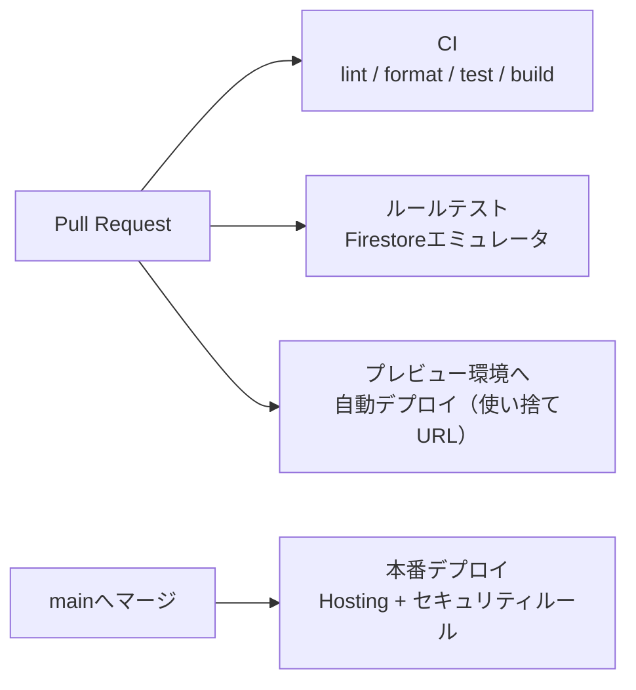
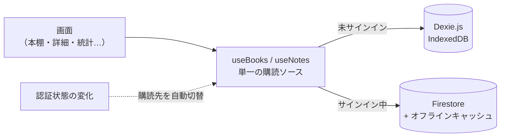

## はじめに

Claude Designで作った本棚アプリ「[ヨミチ](https://yomichi-app.web.app)」のプロトタイプを、Claude Codeとの協働でWebサービスとして公開しました。

https://yomichi-app.web.app/u/unsoluble-sugar

本記事は、認証・クラウド同期・他ユーザー公開・PWA対応までを進めた開発記録です。

:::details 用語メモ：Claude Design
Anthropicが提供するデザイン機能。チャットで対話しながらUIデザインやWebページをビジュアルに作り込める。作ったデザインは動くHTMLとして書き出せるため、そのままプロトタイプとして扱える。

https://support.claude.com/ja/articles/14604416-claude-design%E3%82%92%E5%A7%8B%E3%82%81%E3%82%8B
:::

出発点は、Claude Designで作った「動くHTMLプロトタイプ + 仕様README + 実データ884冊」の引き継ぎパッケージです。UI・機能・データの中身をプロトタイプ段階で検証済みだったため、製品化はその移植と裏側の構築に集中できました。


Claude DesignとClaude Codeを連携させた開発事例は、過去記事でも書いています。

https://zenn.dev/unsoluble_sugar/articles/fd73c7b67d80ce

https://zenn.dev/unsoluble_sugar/articles/a4cfe1e4cc9a0d

同じ流れで開発したCloudflare構成のサービス「Mirai Mirror」も先日β版として公開していますが、この開発スタイルで他ユーザーがアカウント認証して使えるサービスを作ったのは、今回が初めてです。

https://zenn.dev/unsoluble_sugar/articles/867452eabeaa20

## 開発の進め方: issue駆動 + 1 issue = 1 PR

最初にやったのはコーディングではなくリポジトリの土台作りです。`CLAUDE.md` / `.claude/rules/` / `.steering/` 等のハーネスを既存リポジトリの規約から踏襲し、ロードマップをissueに分解していきました。

公開までの道のりは5つのフェーズに分け、順に進めました。

| Phase | 内容 |
|---|---|
| 1 | 開発基盤（Vite雛形・CI/CD・Firebase Hosting） |
| 2 | ローカル版移植（全画面・IndexedDB・CSV入出力・バーコード登録） |
| 3 | 認証+クラウド同期（Googleサインイン・Firestore・セキュリティルール） |
| 4 | マルチユーザー公開（公開本棚・オンボーディング・規約類） |
| 5 | PWA（ホーム画面起動・オフライン対応） |
| 追加 | 運用・改善（PA-APIタイトル検索・アカウント削除セルフサービス） |

運用ルールは「1 issue = 1ブランチ = 1 PR。CIとプレビューURLを確認して人間がマージ」。Claude Codeが実装・テスト・PR作成まで自走し、人間はレビュー・マージと、課金や認可が絡むコンソール作業だけを担当する分業です。

## 技術構成: Vite + React + TypeScript

技術スタックの選定もコーディングより先に行い、Claude Designからの引き継ぎ資料に含めた推奨構成を元に検討した結果をロードマップの親issueへ「技術方針」として書き残してから着手しました。

今回採用したのは **React + TypeScript + Vite** です。

https://vite.dev/

ビルドツールのViteは、現在のReact SPA開発で事実上の標準になっている選択です。設定ほぼゼロで開発サーバーからビルド・静的出力までが揃い、テストは[Vitest](https://vitest.dev/)、PWA化は[vite-plugin-pwa](https://vite-pwa-org.netlify.app/)と、周辺ツールも同じエコシステムで完結します。

ビルド成果物が静的ファイルなので、Firebase Hostingにそのまま載せられる点も好都合でした。

### React + TypeScriptを選んだ3つの決め手

**1. カメラのバーコード読み取りにHTTPS配信が必須**

本のバーコードをカメラで読み取って登録する機能は、このアプリの中核です。ブラウザのカメラAPIはHTTPSで配信されたページでしか動かないため、ネイティブアプリにしない限りWeb + HTTPS配信の構成が前提になります。どのみちHTTPSで出すなら、ホーム画面起動やオフライン対応まで含めたPWAに寄せるのが自然で、Vite + Reactはその構成と相性が良い選択でした。

**2. プロトタイプからの移植が素直**

Claude Designが書き出したプロトタイプは「テンプレート + React風Componentクラス」という構造で、コンポーネントの分割や状態の持ち方をほぼそのままReactに写せます。今回の方針は「プロトタイプの実挙動を正解データとして忠実移植する」ことなので、構造ごと別物になるフレームワークを選ぶと移植の対応関係が崩れ、検証コストが跳ね上がります。移植元と地続きであることは、速度だけでなく忠実性の面でも重要でした。

**3. 将来のスマホアプリ化でもWeb資産を使い回せる**

いずれネイティブ配信（Capacitor等でのアプリストア配信）を検討する可能性がありますが、React + TypeScriptで書いたロジックとUIはそのまま持ち込めます。まずWebで出して反応を見て、必要になったらアプリとして包む。この段階的な進め方ができるのは、Web資産を核にした構成ならではです。

https://capacitorjs.jp/

### domain層の隔離とリグレッションテスト

移植で鍵になったのは **domain層を純粋関数に隔離** したことです。

```
app/src/
├── domain/    # 純粋関数のみ（React・DB非依存）: ISBN変換・分類・CSV・フィルタ・正規化
├── db/        # Dexie.js(IndexedDB) スキーマとリポジトリ
├── firebase/  # Auth / Firestore / Functions クライアント
├── store/     # zustand（UI・セッション状態のみ）
└── features/  # 画面（shelf / detail / stats / add / share / public …）
```

プロトタイプのロジック（チェックディジット計算、順序依存のカテゴリ分類、[ブクログ](https://booklog.jp/)互換CSV生成）をここへ忠実に移植し、**プロトタイプの実挙動を正解データにしたリグレッションテストを通してから** 画面を組みました。

:::details 補足：テストで固定した「一見バグっぽい実挙動」の例
- 日本語の `localeCompare` による並び替えは、カタカナ→漢字の順になる
- タグ確定処理では「`#`除去」がtrimより先に走る

どちらも一見バグに見えますが、プロトタイプで実際に動いていた挙動です。domain層に限らず、こうした挙動をテストで「これが正解」として固定しておくことで、移植中に善意で「直して」しまう事故を防げます。
:::

以降のリファクタリングや同期層の差し替えは、AIに任せてもテストが守ってくれました。

状態管理は [zustand](https://github.com/pmndrs/zustand)（UI状態のみ）とDB購読（[Dexie.js](https://dexie.org/) liveQuery / Firestore onSnapshot）の2層で、Redux等は使っていません。ルーティングは [React Router](https://reactrouter.com/) で、書籍詳細などのオーバーレイもブラウザ履歴に積み、スマホの「戻る」でシートが閉じるようにしています。

### 実データで設計を検証する

設計を確定する前に手元の実データ884冊で検証したところ、想定が何度もひっくり返りました。

- **611冊（69%）がASIN（Kindle本）** だった
  - 「ISBNなし→ハッシュID」の当初設計を捨て、ASIN等の識別子をそのままIDに使う設計へ変更
- 雑誌JANコードの本（1冊だけ存在）がCSVの再インポートで複製された
  - タイトル+著者の突き合わせを追加して重複を防止
- 「又吉直樹」と「又吉 直樹」がスペース有無で別著者扱いになった
  - NFKC正規化+空白除去で同一視

主キーは本の識別子から決定的に生成する「安定ID」にしました。プロトタイプの保存キーは配列indexで、並び替えるとデータが壊れる構造だったためです。

| 本の識別子 | 安定ID |
|---|---|
| ISBN13 | そのまま使用 |
| ISBN10 | ISBN13へ変換して使用 |
| ASIN（Kindle本） | そのまま使用 |
| なし（雑誌コード等） | タイトル+著者のハッシュ |

同じ入力なら常に同じIDになるため、再インポートや同期で同じ本が別IDになることがありません。削除は `deleted` フラグの論理削除とし、カテゴリ色などの派生値は保存せず読み出し時にdomain層で計算します。

## Firebaseという選択

バックエンドはFirebase / Cloudflare（Pages + Workers + D1想定） / Supabaseを比較しました。

| 観点 | Firebase | Cloudflare | Supabase |
|---|---|---|---|
| Googleアカウント認証 | ◎ 標準機能 | 自前実装が必要 | ○ Auth機能あり |
| オフライン同期 | ◎ SDKに組み込み済み | 自前実装が必要 | △ 弱い |
| モバイルSDK（将来のアプリ化） | ◎ 公式SDKあり | − | ○ |
| 無料枠 | 個人利用に十分 | 潤沢 | 十分 |

認証・オフライン同期・将来のモバイル対応を追加の作り込みなしで揃えられるのはFirebaseだけでした。手軽に扱えるGitHub Pagesではなく「別サービスを使った知見を貯めたかった」という動機もあります。

### Hosting: PRごとのプレビューチャンネル

Firebase Hostingは **PRごとにプレビューチャンネル**（使い捨てURL）を発行してくれます。カメラ機能のようにHTTPS必須・実機確認必須の開発では、これが一番便利でした。

https://firebase.google.com/docs/hosting/test-preview-deploy?hl=ja

:::message
プレビューチャンネルのドメインはFirebase Authの承認済みドメインに含まれないため、サインインが絡む検証はlocalhostか本番で行う必要があります。プレビューは「見た目と非認証機能の実機確認」用と割り切っています。
:::

もうひとつハマったのが **チャンネル数の上限** です。プレビューチャンネルにはサイトあたり50個の内部クォータがあり（公式ドキュメント未記載・引き上げ不可）、PRを重ねるうちに上限へ達してデプロイが失敗しました。

https://x.com/unsoluble_sugar/status/2090428173838320018?s=20

デフォルトの有効期限（7日）で消えるのを待つ運用だと、開発ペースによっては先に上限へ届いてしまいます。対策として、プレビューの有効期限を3日に短縮したうえで、PRのクローズ（マージ含む）をトリガーに該当チャンネルを削除するジョブをワークフローへ追加しました。

CI/CDはmainマージからデプロイまで全自動で、人間はプレビューURLをスマホで開いて確認するだけです。



### Firestore: 双方向同期はやらない

同期の設計で決めたのは「**Dexie.jsを正とした双方向同期はやらない**」ことです。やると端末間の競合解決や削除の伝播を自前実装することになり、Firestoreが持つオフライン機能の再発明になってしまいます。

- データの「正」は認証状態で切り替える
  - サインイン中: オフライン永続化を有効にしたFirestoreが正
  - 未サインイン: Phase 2で作ったDexie.js（IndexedDB）のローカルモードをそのまま使用
- 画面は `useBooks()` フックの単一ソースにし、認証状態で購読先を自動切替
  - UIコードは無変更で済んだ
- 初回サインイン時にローカル全件を一括アップロード
  - `writeBatch` の500件制限があるため450件ずつ・冪等フラグ付き
- 競合はドキュメント単位のlast-write-wins（Firestore既定）
  - 単一ユーザー×複数端末ならこれで十分

https://firebase.google.com/docs/firestore/manage-data/enable-offline?hl=ja



### クラウド側のデータモデル

ローカルの books / notes をほぼ同じ形のままユーザー配下のサブコレクションに置いただけです。同期時のデータ詰め替えがなく、初回アップロードは全件コピーで済みます。

```
users/{uid}                  … プロフィール（初回同期フラグ・公開設定）
users/{uid}/books/{bookId}   … 蔵書。ローカルの books と同じ形 + updatedAt
users/{uid}/notes/{noteId}   … メモ・引用
publicShelves/{shareId}      … 公開本棚（タイトル・冊数・公開用サブセットの配列）
```

公開本棚だけは作りが違い、蔵書のサブコレクションを読ませるのではなく **公開してよいフィールドだけを抜き出した配列を1ドキュメントに複製** します。ルールを「publicShelvesは誰でも読める・それ以外は本人のみ」と単純に保て、非公開情報が混ざる余地も構造的にありません。閲覧1回=読取1回に収まるのでコスト面でも有利です。

### セキュリティルール: テストとCIで守る

ルールは「`users/{uid}/**` は本人のみ + スキーマ検証（ステータス4値限定・rating 0〜5・型チェック）」。書きっぱなしにせず、`@firebase/rules-unit-testing` でエミュレータ上の検証20件超（他人uidの偽装書き込み拒否、未認証の全拒否など）をCIに組み込みました。ルールのデプロイもmainマージで自動化しています。

https://firebase.google.com/docs/rules/unit-tests?hl=ja

## 他ユーザーに公開できる形へ

### 書影の権利調査

公開サービス化で一番時間を使ったのは、コードではなく書影の権利調査でした。

| 書影ソース | 調査結果 |
|---|---|
| Amazon画像URL直リンク（プロトタイプで使用） | 自分用ならまだしも、第三者向け公開サービスでの無断利用は規約上の懸念があり不採用 |
| NDLサーチ書影API | **[2026年3月で提供終了済み](https://current.ndl.go.jp/car/267841)** のため不採用 |
| [openBD](https://openbd.jp/)書影 | [規約](https://openbd.jp/terms/)はクリーンだが、実測したらカバー率1冊/884冊で不採用 |

結論は「Amazonアソシエイト経由の正規利用」です。公開ページの書影をアソシエイトタグ付き商品リンクとセットにし、開示文言を明示する構成にしました。副産物として、ASINで書影が引けるため、大多数を占めていたKindle本にも表紙が付くようになりました。


### 公開ページとアカウント削除

- 本棚は既定非公開。公開すると推測困難な128bit IDの共有URLを発行（`/u/{shareId}`）
  - noindexはmetaタグとhostingヘッダーの二重掛け
- 新規ユーザーは空本棚+オンボーディングにし、プライバシーポリシー・利用規約を整備
- アカウント削除は「運営者に連絡」ではなく、**Google再認証を本人確認に使うセルフサービス** に
  - 依存関係の逆順（公開ページ→蔵書→メモ→プロフィール→Authアカウント）で削除
  - ルール上本人はすべて削除できるため、Functions不要・クライアント完結で実装できた


:::message
本記事に載せた筆者の本棚URL（`/u/unsoluble-sugar`）が読める文字列なのは、開発者アカウント限定で先行提供しているカスタムスラッグ機能によるものです。一般ユーザーの共有URLは上記の128bit IDになります。
:::

### タイトル検索: 初のサーバーサイド（Cloud Run Functions）

「紙の本/Kindle切替 → タイトル検索 → 選んで登録」というタイトル検索機能も実装しました（次節の事情により現時点では未公開の機能です）。

検索にはPA-API（Amazon商品検索API）を使います。PA-APIはSecretKeyでリクエスト署名するためブラウザから呼べず、ここで本プロジェクト初のサーバーサイドコードとして、[Cloud Functions](https://firebase.google.com/docs/functions?hl=ja)（第2世代・実体はCloud Run）によるプロキシが登場します。


- APIキーは[Functions Secrets](https://firebase.google.com/docs/functions/config-env?hl=ja)（Secret Manager）に保管
  - チャットを経由させず、`firebase functions:secrets:set` の対話入力で人間が直接登録
- [AWS SigV4署名](https://docs.aws.amazon.com/ja_jp/IAM/latest/UserGuide/reference_sigv4.html)は依存を増やさず自前実装（`node:crypto` のみ）
  - 次節のCreators API移行でOAuth 2.0に置き換え
- onCallで認証必須にし、`maxInstances: 3` で暴走上限も設定

Blazeプラン（従量課金プラン）化にあたっては「全体=予算アラートで通知、Functions系=利用額上限でハードストップ」の2段構えにしました。

:::details 補足：Google Cloudの利用額上限の対象範囲
利用額上限（spending limit）は「1プロジェクト×1サービス」単位で、Cloud Run / Cloud Run Functionsなど一部のサービスにしか設定できません。FirestoreやHostingは対象外のため、そちらは予算アラートでカバーする、という整理が必要でした。

https://cloud.google.com/billing/docs/how-to/budgets
:::

### 商品検索の壁: 資格要件とPA-API廃止

実装とデプロイまで進めたところで、最後に **アソシエイトの資格要件** に引っかかりました。キーも実装も正しいのに「Your account does not currently meet the eligibility requirements」というレスポンスが返ってきます。

PA-APIの利用は売上実績と連動しており、適格販売の実績がないと利用を開始できず、利用中でも直近の売上が途切れると使えなくなります。過去の実績があっても同様で、しかも[自己購入は適格販売にカウントされないどころか規約違反](https://affiliate.amazon.co.jp/help/operating/policies/)です。

https://affiliate.amazon.co.jp/help/node/topic/GW65C7J2CSK7CA6C

そのためタイトル検索は現時点では未公開の機能としています。本番ビルドではタブ自体を非表示にし、資格要件を満たせた時点で公開する予定です。

さらに動作確認を進めながら公式ドキュメントを確認していたところ、**PA-API v5自体が2026年5月に廃止されていた** ことが発覚しました。

自分の知識がPA-APIを使っていた頃で止まっていたうえ、Web上の実装事例もPA-APIに関するものが大半で、AIの提案もPA-API前提。人間もAIも、設計段階では廃止に気づけていませんでした。

なお、旧ドキュメントは現在、後継の **Creators API** への移行を促す告知ページにリダイレクトされます。

https://affiliate-program.amazon.com/creatorsapi/docs/en-us/paapiv5-deprecation

:::message alert
これからAmazonの商品検索を実装する場合は、PA-APIではなく後継のCreators APIを使う必要があります。Web上の実装事例やAIの提案は旧PA-API前提のものがまだ多いので注意してください。
:::

この廃止を受けて、タイトル検索のバックエンドを **Creators API** へ移行し、認証はAWS SigV4署名からOAuth 2.0（client_credentials・トークンは1時間キャッシュ）に全面的に書き換えました。クライアント側のインターフェースは変えていないため、UIは無変更です。

資格要件の扱いはCreators APIでも同じで、検索リクエストは403 AssociateNotEligibleが返ります。要件は[Creators APIの公式ドキュメント](https://affiliate-program.amazon.com/creatorsapi/docs/en-us/introduction)に明記されています。

> Have at least 10 qualifying sales within the past 30 days to access the PA API through the Creators API
> （Creators API経由でPA APIへアクセスするには、直近30日間に10件以上の適格販売が必要）

バックエンドは要件を満たせば再デプロイ不要でそのまま通るため、公開時にやることはタブの表示を戻すだけです。

### 公開ページの動的OGP

タイトル検索で導入したCloud Functionsは、公開ページのOGP生成にも活用しています。公開URLをSNSでシェアしたときに「◯◯の本棚」というタイトル入りのカードが出るようにするためです。SNSクローラーはJavaScriptを実行しないため、SPAのままではページごとにメタタグを変えられません。

- FunctionsでHostingの `index.html` を取得し、`og:title` 等を公開タイトルに置換して返す
  - OGP画像（1200x630のPNG）は[satori](https://github.com/vercel/satori) + resvgでSVGから生成
  - 公開タイトルと冊数だけをFirestore RESTのfield maskで取得し、巨大な蔵書配列は読まない
- Hostingのrewriteで `/u/**` をFunctionsへ向ける
  - 通常のブラウザにはService WorkerがSPAシェルを返すため、Functionsを通るのは実質SNSクローラーと初回訪問のみ
  - CDNキャッシュも効かせて実行回数を抑制


## PWA対応: ホーム画面から起動できるアプリへ

公開フェーズの仕上げとして、[vite-plugin-pwa](https://vite-pwa-org.netlify.app/)でPWA対応を行いました。「ホーム画面に追加」でアプリとして起動でき、オフラインでも閲覧・編集ができます。


- **アプリシェルのプリキャッシュ**: JS/CSS/HTML・フォント一式をWorkboxでプリキャッシュ
  - 機内モードでも起動し、Dexie.js / Firestoreのオフラインキャッシュと合わせて閲覧・編集まで動く
- **ランタイムキャッシュ**: Amazon書影はcache-first（30日）、Google Fontsも長期キャッシュにして通信量を抑制
- **更新は通知式**: 新バージョン検出時に「新しいバージョンがあります」のトーストを出し、ユーザー操作で更新する方式（`registerType: prompt`）
- **ファビコン・OGPも一括整備**: ロゴSVGから各サイズのアイコンとOGP画像をスクリプト生成

ハマったのは更新トーストです。「更新」ボタンを押しても、**タブを開いた時点で新バージョンがすでに待機していた場合** はページがリロードされないケースがありました。


vite-plugin-pwaのリロードは `isUpdate === true` のときしか発火しないためで、`controllerchange` イベントを自前で監視して確実にリロードする形に修正しています。

:::message
Service Workerの検証は、プレビューチャンネルだと本番と別スコープになるため、最終確認はマージ後の本番環境で行うのが確実です。
:::

## 公開前のセキュリティ精査で見つけた不備

一通り作り終えたあとの精査で、公開モデルの前提を壊す不備が1件見つかりました。

Firestoreのセキュリティルールで、公開本棚を `allow read: if true` にしていました。「リンクを知っている人が読める」つもりの記述ですが、**ルールの `read` は get（1件取得）と list（コレクション一覧クエリ）の両方を含みます**。

つまり誰でもコレクション全体をクエリして、全ユーザーの共有IDと公開本棚を列挙できる状態でした。共有URLを推測困難な128bit IDにしても、一覧で取れてしまえば意味がありません。

https://firebase.google.com/docs/firestore/security/rules-structure

修正は `allow get` / `allow list` への分離、実質1行です。「一覧クエリは拒否・個別取得は成功」をルールテストに追加して再発を塞ぎました。

```diff
 match /publicShelves/{shareId} {
-  allow read: if true;            // get + list の両方を許可してしまう
+  allow get: if true;             // 個別取得（リンクを知っている人）のみ許可
+  allow list: if false;           // 一覧クエリ（共有IDの列挙）は禁止
   ...
 }
```

:::message
**「read」と書いて「getのつもり」になっていないか** は、Firestoreルールを書くなら一度は確認したほうがいいポイントです。「リンクを知っている人だけに公開」の設計なら、`allow get` と `allow list` を分けて書きましょう。
:::

このほか精査で挙がった論点も、issueに積んだうえで順次対応しました。

- コスト攻撃対策の **App Check**（reCAPTCHA v3プロバイダによるクライアント検証）
- 検索APIの **ユーザー毎レート制限**（1ユーザーの連打によるクォータ独占の防止）
- CSVエクスポートの **数式インジェクション対策**
- **Content-Security-Policyヘッダ** の導入と、公開本棚ドキュメントからの内部ID（uid）除去

「作って終わり」ではなく、公開範囲が広がるタイミングごとに脅威モデルを見直す前提で進めています。

## ハマったポイント一覧

| 事象 | 原因 | 対処 |
|---|---|---|
| ルールテスト「No test files found」 | vitest `--dir` とinclude設定の競合 | configのincludeに一本化 |
| エミュレータ起動失敗 | CIランナーのJavaが21未満 | setup-java追加 |
| サービスアカウント作成404 / Firestore DB作成403 | GCPのAPI有効化・IAM伝播遅延 | 数十秒〜数分待って再実行 |
| CSV再インポートで本が複製 | 雑誌JANコードがCSVのISBN列に載らない | タイトル+著者の突き合わせ |
| PA-API「key invalid」 | アクセスキー欄にシークレットを登録していた | 形式チェック（長さ・AKIA接頭辞）で発見 |
| PA-API資格エラー | 直近の適格販売が必要（自己購入は不可） | 機能を未公開にして要件回復待ち |
| プレビューURLでサインイン不可 | Authの承認済みドメイン外 | 認証系の検証はlocalhostか本番で実施 |
| プレビューのデプロイ失敗 | チャンネル数がサイトあたり50個の内部クォータに到達 | 有効期限を3日に短縮 + PRクローズ時に自動削除 |
| PWA更新トーストの「更新」が反応しない | 新Service Worker待機済みの場合リロードが発火しない | `controllerchange` を自前監視してリロード |

## やらないと決めたこと

作ったものと同じくらい、意図的に捨てた選択があります。

- **E2Eテストは書かない**: 画面の通し確認はPRごとのプレビューURL+実機で行う
  - 個人開発の規模ではE2Eの維持コストが見合わず、ロジックの正しさはdomain層のユニットテストが担保する
- **双方向同期は作らない**: 前述のとおりFirestoreのオフライン機能に一本化
- **ダークモード・多言語対応は見送り**: プロトタイプに存在しない仕様は製品化スコープに足さない
- **フルSSRはしない**: SPA+PWAで完結。例外は公開ページのOGPだけで、前述のとおりSNSクローラー向けにCloud Functionsで動的生成している

:::details 用語メモ：SPA / SSR / PWA
- **SPA（Single Page Application）**: 最初にHTMLとJavaScriptを1回読み込み、以降のページ遷移をブラウザ内の描画切り替えで行うWebアプリの構成。サーバーは静的ファイルを配信するだけで済む。本アプリはこの構成
- **SSR（Server-Side Rendering）**: ページのHTMLをリクエストのたびにサーバー側で生成して返す方式。表示の初速やSEO・OGP対応に有利だが、サーバー側の実行環境が必要になる
- **PWA（Progressive Web App）**: Webサイトをスマホアプリのようにホーム画面から起動・オフライン利用できるようにする仕組み。アプリストアを経由せず、Webの配信インフラのままアプリ体験を提供できる

https://developer.mozilla.org/ja/docs/Glossary/SPA

https://developer.mozilla.org/ja/docs/Web/Progressive_web_apps
:::

## 費用の概算

FirebaseをBlaze（従量課金）化しましたが、現時点の想定コストは **月0〜数百円** です。

https://firebase.google.com/docs/projects/billing/firebase-pricing-plans?hl=ja

Firestore・Hosting・Cloud Run・Secret Managerはいずれも個人利用なら無料枠内に収まり、従量課金の実態はFunctionsのコンテナイメージを置くArtifact Registry（無料枠0.5GB）がわずかに超えるかどうか、という程度。

それでも暴走への備えとして、前述の予算アラート+利用額上限の2段構えは入れてあります。

## おわりに

プロトタイプの引き継ぎから、認証・クラウド同期・他ユーザー公開・PWAまで到達できました。振り返って大きかったのは次の3点です。

- **進め方を最初に固めた**: issue駆動・1PR単位・CI+プレビュー確認の型を初日に作った。調査結果や設計判断もissueに書き残したので、セッションをまたいでも文脈が復元できる
- **実データ検証を設計より先に**: ASIN 69%、openBD書影1/884のような「現実」が机上の設計を何度もひっくり返した。作る前に測る・調べるのが結局最短だった
- **人間の担当を明確に**: マージ判断・課金プラン変更・OAuth認可・APIキー登録は人間側。それ以外はClaude Codeが自走する分業が成立した

Firebase（Hosting + Auth + Firestore + Cloud Run）は、個人開発の「認証つき同期サービス」に必要な部品が無料枠内で一通り揃います。プレビューチャンネルとエミュレータテストは特におすすめです。

公開後もローディングアニメーションの作り込みなど、細かな改善を続けています。残バックログにはネイティブアプリ配信の判断などが積んであり、公開範囲を広げるタイミングで、また記録を残そうと思います。

「ヨミチ」は機能を絞ったシンプルな本棚管理アプリで、どなたでも無料で使えます。興味を持たれた方は、ぜひ触ってみてください。

https://yomichi-app.web.app
